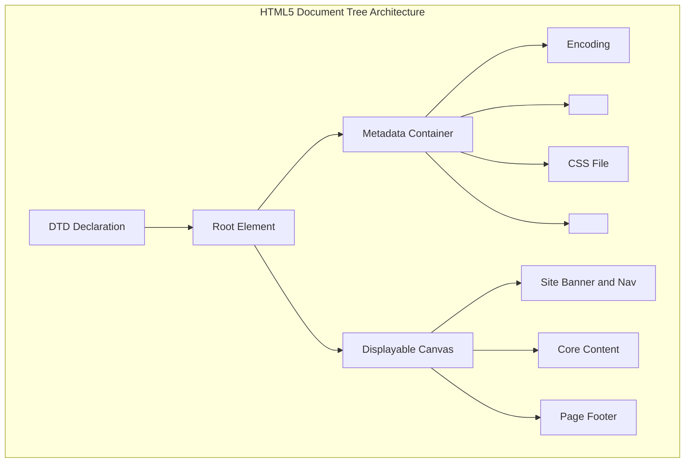
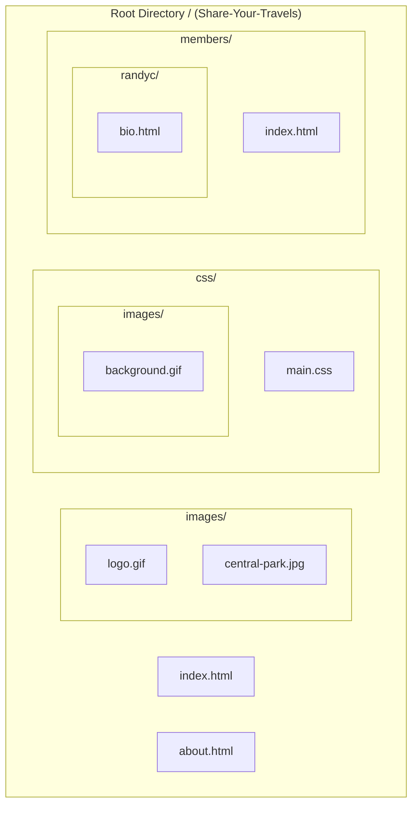

# HTML5 Markup Structure, Semantics, XHTML Standards, and URL Navigation

[← Back to Course README](../README.md)

- [1. Web Architecture, HTML Evolution, and W3C Standards](#1-web-architecture-html-evolution-and-w3c-standards)
- [2. XHTML 1.0 Strict Syntax vs HTML5 Specification](#2-xhtml-10-strict-syntax-vs-html5-specification)
- [3. Complete Anatomical Structure of an HTML5 Document](#3-complete-anatomical-structure-of-an-html5-document)
- [4. Text Formatting, Headings, Whitespace Handling, and Semantic Tags](#4-text-formatting-headings-whitespace-handling-and-semantic-tags)
- [5. Hyperlinks, Link Destinations, and Link Text Best Practices](#5-hyperlinks-link-destinations-and-link-text-best-practices)
- [6. URL Referencing Matrix (Absolute vs Relative Directory Navigation)](#6-url-referencing-matrix-absolute-vs-relative-directory-navigation)
- [7. HTML5 Audio, Video, and Custom JavaScript Media API](#7-html5-audio-video-and-custom-javascript-media-api)
- [8. 8 Solved Practice Questions and Exam Solutions](#8-8-solved-practice-questions-and-exam-solutions)

---

## 1. Web Architecture, HTML Evolution, and W3C Standards

### A. What is a Markup Language?
A **Markup Language** is a system for annotating a text document in a manner that makes annotations syntactically distinct from the primary text content.
- **HyperText Markup Language (HTML)** is the standard markup language for creating web pages.
- HTML elements describe the structural organization of a document (headings, paragraphs, links, media, tables, and forms).

### B. The World Wide Web Consortium (W3C)
- The **W3C** is the main international standards organization for the World Wide Web.
- To promote cross-browser compatibility, W3C publishes official **Recommendations** (web standards specifications).
- In 1998, W3C created **XHTML 1.0**, reforming HTML under strict XML (Extensible Markup Language) syntactic rules to enforce predictable browser page rendering.

---

## 2. XHTML 1.0 Strict Syntax vs HTML5 Specification

In XHTML, pages were required to be well-formed XML documents. HTML5 relaxed syntax constraints while providing semantic tags.

| Rule / Characteristic | XHTML 1.0 Strict Rules | HTML5 Specification |
| :--- | :--- | :--- |
| **XML Declaration** | Mandatory (`<?xml version="1.0" encoding="UTF-8"?>`) | Optional |
| **DOCTYPE Declaration** | Complex DTD reference required | Simple `<!DOCTYPE html>` |
| **Tag and Attribute Case** | Must be strictly **lowercase** | Case-insensitive (lowercase recommended) |
| **Attribute Quotation** | Values **must** be enclosed in quotes (`id="main"`) | Quotes optional for simple strings |
| **Element Closing** | All elements **must** be closed (`<br />`, `<p>...</p>`) | Self-closing slash optional on void tags |
| **Root Attributes** | `xmlns` attribute mandatory in `<html>` | `xmlns` optional; `lang="en"` recommended |
| **Element Nesting** | Strict tree hierarchy; no overlapping tags | Strict DOM tree validation |

```xml
<!-- Example of a Compliant XHTML 1.0 Strict Document Header -->
<?xml version="1.0" encoding="UTF-8"?>
<!DOCTYPE html PUBLIC "-//W3C//DTD XHTML 1.0 Strict//EN"
  "http://www.w3.org/TR/xhtml1/DTD/xhtml1-strict.dtd">
<html xmlns="http://www.w3.org/1999/xhtml" xml:lang="en" lang="en">
<head>
  <title>Strict XHTML 1.0 Page</title>
</head>
<body>
  <p>All elements must be explicitly closed in lowercase.</p>
</body>
</html>
```

---

## 3. Complete Anatomical Structure of an HTML5 Document

An HTML5 document is divided into two primary sections: the **Head** (`<head>`) containing metadata, and the **Body** (`<body>`) containing displayable DOM content.



```html
<!DOCTYPE html>
<html lang="en">
<head>
  <meta charset="utf-8">
  <meta name="viewport" content="width=device-width, initial-scale=1.0">
  <title>Share Your Travels -- New York - Central Park</title>
  <link rel="stylesheet" href="css/main.css">
  <script src="js/main.js"></script>
</head>
<body>
  <header>
    <h1>Share Your Travels</h1>
  </header>
  <main>
    <p>Welcome to Central Park exploration guide.</p>
  </main>
  <footer>
    <p>&copy; 2026 Share Your Travels</p>
  </footer>
</body>
</html>
```

---

## 4. Text Formatting, Headings, Whitespace Handling, and Semantic Tags

### A. Headings (`<h1>` to `<h6>`) and Whitespace Collapse
- HTML provides 6 heading levels (`<h1>` highest to `<h6>` lowest).
- **Semantic Accuracy**: Choose heading levels based on document outline hierarchy, not default browser font size. Use CSS `font-size` for visual sizing (`<h1 style="font-size:60px;">`).
- **Whitespace Collapsing**: Browsers collapse multiple consecutive spaces, tabs, and line breaks into a single space.
- **Preformatted Text (`<pre>`)**: Preserves exact spaces, tabs, and newline characters.

```html
<!-- Whitespace Collapse vs Preformatted Text -->
<p>
  Hello.
  Hi.   (Collapsed into single line with 1 space)
</p>

<pre>
  Hello.
  Hi.   (Preserves exact indentation and newlines)
</pre>
```

### B. HTML Text Formatting Tags Summary

| Tag | Purpose and Meaning | Tag | Purpose and Meaning |
| :--- | :--- | :--- | :--- |
| `<b>` | Bold text (stylistic offset) | `<strong>` | Strong importance (semantic stress) |
| `<i>` | Italic text (idiomatic pitch) | `<em>` | Emphasized text (stress emphasis) |
| `<mark>` | Highlighted / marked text | `<small>` | Side comments / fine print text |
| `<del>` | Deleted text (strikethrough) | `<ins>` | Inserted text (underlined) |
| `<sub>` | Subscript text ($H_2O$) | `<sup>` | Superscript text ($E=mc^2$) |
| `<abbr>` | Abbreviation or acronym | `<hr>` | Thematic break (horizontal rule) |

---

## 5. Hyperlinks, Link Destinations, and Link Text Best Practices

Hyperlinks are created using the anchor element (`<a>`).

$$\text{Hyperlink} = \text{Anchor Tag } (\langle\text{a}\rangle) + \text{Attribute } (\text{href}="\text{destination}") + \text{Label Text / Image} + \text{Closing Tag } (\langle/\text{a}\rangle)$$

### A. Different Link Destinations

```html
<!-- 1. Link to external web site -->
<a href="http://www.centralpark.com">Central Park</a>

<!-- 2. Link to resource on external site -->
<a href="http://www.centralpark.com/logo.gif">Download Logo</a>

<!-- 3. Link to another page within same site -->
<a href="index.html">Home Page</a>

<!-- 4. Link to another place on the same page (Fragment Anchor) -->
<a href="#top">Go to Top of Document</a>

<!-- 5. Link to specific location on another page -->
<a href="productX.html#reviews">Reviews for Product X</a>

<!-- 6. Link to email client -->
<a href="mailto:person@somewhere.com">Send Email</a>

<!-- 7. Link to JavaScript function execution -->
<a href="javascript:OpenAnnoyingPopup();">Trigger Popup</a>

<!-- 8. Link to telephone number (mobile smartphone dialer) -->
<a href="tel:+18009220579">Call Toll Free (800) 922-0579</a>
```

### B. Link Text Best Practices
- **Avoid "Click Here"**: Phrases like "Click Here" do not convey destination context to users or screen readers, and "click" is inaccurate on touchscreens.
- **Descriptive Labels**: Use self-explanatory text (e.g., use "See Race Results" or "Download PDF Guide").

---

## 6. URL Referencing Matrix (Absolute vs Relative Directory Navigation)

Web documents locate assets using two referencing styles following Unix pathname conventions (`/` for directories, `..` for parent folders).



### Directory Navigation Pathname Reference Table

| Navigation Relation | Target File from Source | Relative Path Script Example | Description |
| :--- | :--- | :--- | :--- |
| **Same Directory** | `example.html` from `about.html` | `<a href="example.html">` | Filename only. |
| **Child Directory** | `logo.gif` in `images/` from `about.html` | `<a href="images/logo.gif">` | Subdirectory name + `/` + filename. |
| **Grandchild Directory** | `background.gif` in `css/images/` from `about.html` | `<a href="css/images/background.gif">` | Nested directory names + slashes. |
| **Parent Directory** | `about.html` from `members/index.html` | `<a href="../about.html">` | Uses `../` to move up 1 folder level. |
| **Ancestor (2 Levels)** | `about.html` from `members/randyc/bio.html` | `<a href="../../about.html">` | Strings multiple `../../` to step up levels. |
| **Sibling Directory** | `background.gif` from `members/randyc/bio.html` | `<a href="../../css/images/background.gif">` | Move up via `../../`, then descend into `css/images/`. |
| **Root Reference** | `background.gif` from any file on server | `<a href="/css/images/background.gif">` | Begins with `/` (Root directory of web server). |
| **Default Document** | `index.html` inside `members/` | `<a href="members">` or `<a href="/members">` | Omits filename; server returns `index.html` or `default.html`. |

---

## 7. HTML5 Audio, Video, and Custom JavaScript Media API

HTML5 introduces native `<video>` and `<audio>` tags with multi-codec source fallback:

```html
<video id="myVideo" width="640" height="360" poster="images/poster.jpg">
  <source src="media/clip.mp4" type="video/mp4; codecs='avc1.42E01E, mp4a.40.2'">
  <source src="media/clip.webm" type="video/webm; codecs='vp8, vorbis'">
  Your browser does not support HTML5 video playback.
</video>

<div class="controls">
  <button onclick="playPause()">Play / Pause</button>
  <input type="range" min="0" max="1" step="0.1" onchange="changeVolume(this.value)">
</div>

<script>
  const myVideo = document.getElementById("myVideo");
  function playPause() {
    if (myVideo.paused) { myVideo.play(); }
    else { myVideo.pause(); }
  }
  function changeVolume(val) {
    myVideo.volume = parseFloat(val);
  }
</script>
```

---

## 8. 8 Solved Practice Questions and Exam Solutions

### Question 1: <section> vs <article> Semantic Distinction
- **`<article>`**: Self-contained, independent composition reusable or syndicatable across contexts (e.g., blog post, news story).
- **`<section>`**: Generic thematic grouping of content, typically introduced by a heading.

### Question 2: Document Outline Scoping Rule
Each sectioning element (`<article>`, `<section>`, `<nav>`, `<aside>`) creates a distinct subtree in the Document Outline. An `<h1>` inside an `<article>` is hierarchically scoped to that article without conflicting with top-level page headings.

### Question 3: HTML5 Video Codec Browser Compatibility
H.264 (`.mp4`) provides hardware-accelerated playback across mobile devices and Safari, while WebM (`.webm`) provides royalty-free playback in Chrome and Firefox. Providing both guarantees cross-browser coverage.

### Question 4: Absolute vs Relative URL Referencing
- **Absolute URL**: Specifies protocol, domain, and full path (`https://www.example.com/images/photo.jpg`). Used for external resources.
- **Relative URL**: Specifies asset path relative to the current file location (`images/photo.jpg` or `../css/main.css`). Used for internal site files.

### Question 5: XHTML 1.0 Strict Syntax Requirements
1. Mandatory XML declaration (`<?xml version="1.0" encoding="UTF-8"?>`).
2. Mandatory DOCTYPE referencing strict DTD.
3. Lowercase tag names and attribute names.
4. Quoted attribute values (`id="main"`).
5. All elements explicitly closed (`<br />`).

### Question 6: Preformatted Text vs Standard Paragraph Rendering
Standard `<p>` text collapses multiple consecutive spaces and newlines into a single space. The `<pre>` element preserves exact whitespace indentations and line breaks as typed in source.

### Question 7: Purpose of `<abbr>` and `<figure>` Elements
- **`<abbr>`**: Defines abbreviations or acronyms (`<abbr title="HyperText Markup Language">HTML</abbr>`).
- **`<figure>` / `<figcaption>`**: Groups self-contained content (diagrams, photos, code) with an associated descriptive caption.

### Question 8: Link Destination Protocols
- `mailto:`: Triggers default email client.
- `tel:`: Triggers mobile device phone dialer.
- `javascript:`: Executes inline JavaScript functions on click.
- `#fragmentId`: Scrolls to matching DOM element `id` on the current page.
