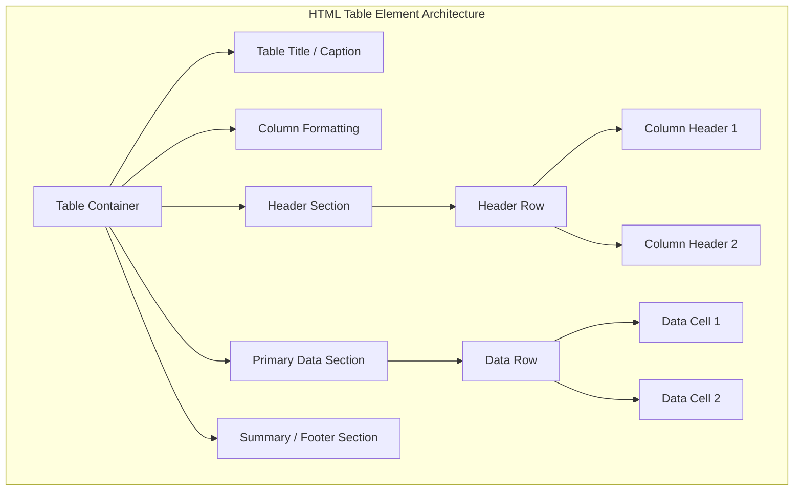
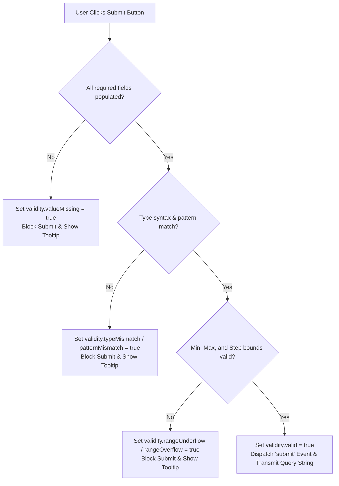

# HTML5 Tables, Forms, Input Controls, and Validation Engine

[← Back to Course README](../README.md)

- [1. HTML Tables, Structural Architecture, and CSS Zebra-Striping](#1-html-tables-structural-architecture-and-css-zebra-striping)
- [2. Deprecated Legacy Table Attributes vs Modern CSS Styling](#2-deprecated-legacy-table-attributes-vs-modern-css-styling)
- [3. Form Architecture, HTTP Query Strings, and GET vs POST Comparison](#3-form-architecture-http-query-strings-and-get-vs-post-comparison)
- [4. HTML5 Form Controls Taxonomy and Input Types Reference](#4-html5-form-controls-taxonomy-and-input-types-reference)
- [5. Choice Controls, Radio Buttons, Checkboxes, and Dropdown Lists](#5-choice-controls-radio-buttons-checkboxes-and-dropdown-lists)
- [6. Native Constraint Validation Engine and ValidityState API](#6-native-constraint-validation-engine-and-validitystate-api)
- [7. Executable Code: Complete HTML5 Form with Tables and Validation](#7-executable-code-complete-html5-form-with-tables-and-validation)
- [8. 8 Solved Practice Questions and Exam Solutions](#8-8-solved-practice-questions-and-exam-solutions)

---

## 1. HTML Tables, Structural Architecture, and CSS Zebra-Striping

### A. Table Structure Elements
An HTML table (`<table>`) displays tabular data in a grid of rows (`<tr>`) and cells (`<td>` for data, `<th>` for headers).



### B. Spanning Rows and Columns
- **`colspan`**: Spans a cell across multiple columns (`<td colspan="3">`).
- **`rowspan`**: Spans a cell across multiple rows (`<td rowspan="2">`).

```html
<!-- Table Spanning Example -->
<table border="1">
  <thead>
    <tr>
      <th rowspan="2">Student Name</th>
      <th colspan="2">Exam Scores</th>
    </tr>
    <tr>
      <th>Midterm</th>
      <th>Final</th>
    </tr>
  </thead>
  <tbody>
    <tr>
      <td>Alice Smith</td>
      <td>88</td>
      <td>94</td>
    </tr>
  </tbody>
</table>
```

---

## 2. Deprecated Legacy Table Attributes vs Modern CSS Styling

In legacy HTML (1990s), tables were used for page layout with presentation attributes. In modern web standards, all presentation is delegated to CSS.

| Legacy Attribute | Deprecated HTML Syntax | Modern CSS Equivalent Property |
| :--- | :--- | :--- |
| **Cell Padding** | `<table cellpadding="10">` | `td, th { padding: 10px; }` |
| **Cell Spacing** | `<table cellspacing="5">` | `table { border-spacing: 5px; border-collapse: separate; }` |
| **Border Collapse** | `<table border="1">` | `table { border-collapse: collapse; }` |
| **Background Color** | `<table bgcolor="#ff0000">` | `table, td { background-color: #ff0000; }` |
| **Cell Dimension** | `<td width="200" height="50">` | `td { width: 200px; height: 50px; }` |
| **Table Alignment** | `<table align="center">` | `table { margin: 0 auto; }` |

### CSS Zebra-Striping & Hover Effects

```css
/* Modern CSS Table Styling with Zebra-Striping */
table {
  width: 100%;
  border-collapse: collapse;
}

th, td {
  padding: 12px 15px;
  text-align: left;
  border-bottom: 1px solid #ddd;
}

th {
  background-color: #007acc;
  color: white;
}

/* Zebra-striping even rows */
tbody tr:nth-child(even) {
  background-color: #f2f2f2;
}

/* Hover highlight effect */
tbody tr:hover {
  background-color: #e6f2ff;
  transition: background-color 0.2s ease;
}
```

---

## 3. Form Architecture, HTTP Query Strings, and GET vs POST Comparison

Web forms allow users to submit input data to a web server for processing.

### A. HTTP Query String Packaging
When a user submits a form, the browser packages input control values into a **Query String** formatted as `name=value` pairs joined by ampersands (`&`):

$$\text{Query String} = \text{field1}=\text{value1} \;\&\; \text{field2}=\text{value2} \;\&\; \text{field3}=\text{value3}$$

### B. Detailed GET vs POST Method Comparison

| Feature / Criteria | GET Method (`method="GET"`) | POST Method (`method="POST"`) |
| :--- | :--- | :--- |
| **Data Transmission** | Appended directly to URL address bar (`?q=search&lang=en`). | Encapsulated inside HTTP request payload body. |
| **Visibility** | Publicly visible in browser address bar. | Hidden from end users in URL bar. |
| **Data Length Limit** | Restricted by max URL length (~2,048 chars). | Virtually unlimited payload size. |
| **Browser Caching** | Cached by browser; stored in browsing history. | Never cached by default; not stored in history. |
| **Bookmarking** | Can be bookmarked with query parameters intact. | Cannot be bookmarked directly. |
| **Data Types** | ASCII text strings only. | Binary data allowed (e.g. file uploads via `multipart/form-data`). |
| **Use Case** | Idempotent read operations (e.g. search queries). | Non-idempotent write operations (e.g. logins, payments). |

---

## 4. HTML5 Form Controls Taxonomy and Input Types Reference

HTML5 expands standard text inputs with over 20 specialized types.

| Input Type | Functional Role & Format | Example HTML Markup |
| :--- | :--- | :--- |
| `type="text"` | Single-line plain text box. | `<input type="text" name="username">` |
| `type="password"` | Single-line masked text input. | `<input type="password" name="pwd">` |
| `type="email"` | Validates RFC email syntax. | `<input type="email" name="userEmail">` |
| `type="url"` | Validates absolute URI (`http://`). | `<input type="url" name="website">` |
| `type="tel"` | Phone number entry (validated via `pattern`). | `<input type="tel" name="phone">` |
| `type="search"` | Search input with quick-clear button. | `<input type="search" name="q">` |
| `type="number"` | Numeric input with `min`, `max`, `step`. | `<input type="number" min="1" max="100">` |
| `type="range"` | Visual slider bar for bounded values. | `<input type="range" min="0" max="10">` |
| `type="color"` | Color picker palette interface. | `<input type="color" name="theme">` |
| `type="date"` | Calendar picker (`yyyy-mm-dd`). | `<input type="date" name="dob">` |
| `type="time"` | Time picker (`HH:MM:SS`). | `<input type="time" name="appt">` |
| `type="month"` | Month and year picker (`yyyy-mm`). | `<input type="month" name="cardExpiry">` |
| `type="week"` | Week number in year (`yyyy-W##`). | `<input type="week" name="payWeek">` |
| `type="hidden"` | Transmits hidden state to server without rendering UI. | `<input type="hidden" name="csrfToken" value="xyz">` |
| `type="file"` | File upload dialog. | `<input type="file" name="attachment">` |

---

## 5. Choice Controls, Radio Buttons, Checkboxes, and Dropdown Lists

### A. Radio Buttons vs Checkboxes
- **Radio Buttons (`<input type="radio">`)**: Mutually exclusive selection (only one option selectable). Created by assigning the exact same `name` attribute to all group items.
- **Checkboxes (`<input type="checkbox">`)**: Independent multi-selection (zero or more options selectable).

```html
<!-- Radio Button Group (Mutually Exclusive via shared name="gender") -->
<label><input type="radio" name="gender" value="male" checked> Male</label>
<label><input type="radio" name="gender" value="female"> Female</label>

<!-- Checkbox Group (Independent Multi-Selection) -->
<label><input type="checkbox" name="skills" value="html"> HTML5</label>
<label><input type="checkbox" name="skills" value="css"> CSS3</label>
<label><input type="checkbox" name="skills" value="js"> JavaScript</label>
```

### B. Select Lists and Fieldset Grouping
- **`<select>` & `<option>`**: Dropdown list control. Use `<optgroup>` to group options logically.
- **`<fieldset>` & `<legend>`**: Groups related form controls visually with a caption border.

```html
<fieldset>
  <legend>Course Selection</legend>
  <label for="course">Select Module:</label>
  <select id="course" name="course">
    <optgroup label="Frontend">
      <option value="ics244_html">HTML5 Semantics</option>
      <option value="ics244_css">CSS3 Layouts</option>
    </optgroup>
    <optgroup label="Programming">
      <option value="ics244_js">JavaScript ES6+</option>
    </optgroup>
  </select>
</fieldset>
```

---

## 6. Native Constraint Validation Engine and ValidityState API

HTML5 performs client-side constraint validation natively before form submission.



| ValidityState Property | Condition That Triggers Error |
| :--- | :--- |
| `validity.valueMissing` | `required` field is empty. |
| `validity.typeMismatch` | Email or URL syntax is invalid. |
| `validity.patternMismatch` | Input text fails regex specified in `pattern`. |
| `validity.rangeUnderflow` | Numeric value is less than `min`. |
| `validity.rangeOverflow` | Numeric value is greater than `max`. |
| `validity.stepMismatch` | Numeric value does not fit `step` interval. |
| `validity.tooLong` | Character length exceeds `maxlength`. |
| `validity.tooShort` | Character length is under `minlength`. |
| `validity.customError` | Custom message set via `element.setCustomValidity("msg")`. |
| `validity.valid` | Returns `true` when all validation constraints pass. |

---

## 7. Executable Code: Complete HTML5 Form with Tables and Validation

```html
<!DOCTYPE html>
<html lang="en">
<head>
  <meta charset="UTF-8">
  <title>Complete HTML5 Form & Table Demo</title>
  <style>
    body { font-family: Arial, sans-serif; background: #f4f6f9; padding: 20px; }
    .card { max-width: 600px; margin: 0 auto; background: #fff; padding: 25px; border-radius: 8px; box-shadow: 0 4px 12px rgba(0,0,0,0.1); }
    fieldset { border: 1px solid #ccc; border-radius: 6px; padding: 15px; margin-bottom: 20px; }
    legend { font-weight: bold; color: #007acc; padding: 0 6px; }
    .form-row { margin-bottom: 12px; }
    label { display: block; margin-bottom: 4px; font-weight: bold; }
    input[type="text"], input[type="email"], select { width: 100%; padding: 8px; box-sizing: border-box; border: 1px solid #ccc; border-radius: 4px; }
    
    /* Table Styling */
    table { width: 100%; border-collapse: collapse; margin-top: 10px; }
    th, td { padding: 8px; border: 1px solid #ddd; text-align: left; }
    th { background-color: #007acc; color: white; }
    tr:nth-child(even) { background-color: #f9f9f9; }

    button { padding: 10px 20px; background: #28a745; color: white; border: none; border-radius: 4px; cursor: pointer; font-size: 16px; }
    button:hover { background: #218838; }
  </style>
</head>
<body>

<div class="card">
  <h2>Student Registration Portal</h2>
  
  <form id="studentForm" action="/register" method="POST">
    <fieldset>
      <legend>Personal Credentials</legend>
      <div class="form-row">
        <label for="fullName">Full Name:</label>
        <input type="text" id="fullName" name="fullName" required pattern="[A-Za-z ]{3,30}">
      </div>
      <div class="form-row">
        <label for="email">Email Address:</label>
        <input type="email" id="email" name="email" required>
      </div>
    </fieldset>

    <fieldset>
      <legend>Course Grade Summary</legend>
      <table>
        <thead>
          <tr>
            <th>Module Name</th>
            <th>Credit Hours</th>
            <th>Grade</th>
          </tr>
        </thead>
        <tbody>
          <tr>
            <td>HTML5 Semantics</td>
            <td>3</td>
            <td>A</td>
          </tr>
          <tr>
            <td>CSS3 Layouts</td>
            <td>3</td>
            <td>A+</td>
          </tr>
        </tbody>
      </table>
    </fieldset>

    <button type="submit">Submit Registration</button>
  </form>
</div>

</body>
</html>
```

---

## 8. 8 Solved Practice Questions and Exam Solutions

### Question 1: Difference Between GET and POST Methods
- **GET**: Transmits query parameters via URL bar (`?name=val`). Visible in history, cached, length limited (~2,048 chars). Used for search queries.
- **POST**: Transmits data inside HTTP request body. Hidden from URL bar, non-cached, supports binary uploads, no payload limit. Used for logins and transactions.

### Question 2: Purpose of `colspan` and `rowspan` Attributes
- **`colspan`**: Spans a table cell across multiple columns (`<td colspan="2">`).
- **`rowspan`**: Spans a table cell across multiple rows (`<td rowspan="3">`).

### Question 3: Why Tables Should Not Be Used for Page Layout
Using `<table>` for page layouts bloats HTML file size, breaks accessibility for screen readers, violates separation of concerns, and creates non-responsive layouts. Use CSS Flexbox or Grid instead.

### Question 4: Radio Buttons vs Checkboxes Grouping Rule
- Radio buttons require the exact same `name` attribute to enforce mutual exclusivity (only one radio selectable per group).
- Checkboxes can share a `name` attribute while allowing multiple items to be selected independently.

### Question 5: Purpose of `<fieldset>` and `<legend>` Elements
- **`<fieldset>`**: Encloses related form fields inside a visual box container.
- **`<legend>`**: Provides a visual and semantic title caption for the `<fieldset>`.

### Question 6: Difference Between `<progress>` and `<meter>`
- **`<progress>`**: Measures dynamic completion progress of an ongoing process (e.g. file upload %).
- **`<meter>`**: Measures a static scalar value within a known min-max range (e.g. disk space usage).

### Question 7: How Query Strings Package Form Data
Form fields are packaged as URL-encoded `name=value` pairs separated by ampersands (`&`), e.g., `username=JohnDoe&email=john%40example.com`.

### Question 8: How JavaScript `setCustomValidity()` Works
`element.setCustomValidity("Custom message")` sets a custom error string on the element's `validity.customError` property, triggering native browser tooltips and blocking form submission until cleared with `setCustomValidity("")`.
