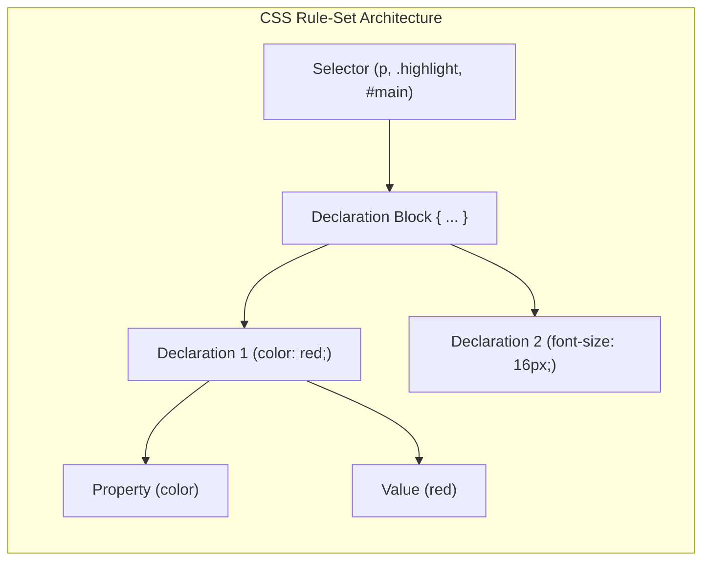
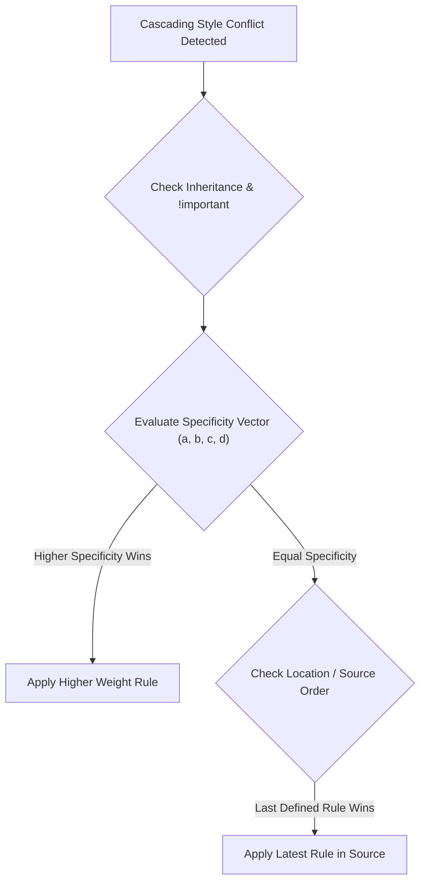
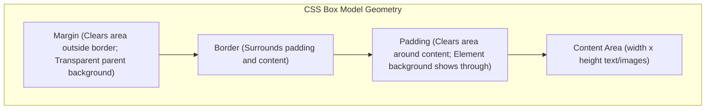

# CSS3 Selectors, Specificity Math, Cascade Architecture, Box Model, and Advanced Positioning

[← Back to Course README](../README.md)

- [1. CSS Evolution, Syntax Rule-Set Anatomy, and Benefits](#1-css-evolution-syntax-rule-set-anatomy-and-benefits)
- [2. CSS Color Models and Units of Measurement Matrix](#2-css-color-models-and-units-of-measurement-matrix)
- [3. Style Locations (Inline, Embedded, External) and Style Sources](#3-style-locations-inline-embedded-external-and-style-sources)
- [4. Complete CSS Selectors Taxonomy (Combinators and Attribute Selectors)](#4-complete-css-selectors-taxonomy-combinators-and-attribute-selectors)
- [5. The 3 Cascade Principles (Inheritance, Specificity Vector Math, Location)](#5-the-3-cascade-principles-inheritance-specificity-vector-math-location)
- [6. The CSS Box Model, Background Properties, and Border Specs](#6-the-css-box-model-background-properties-and-border-specs)
- [7. Normal Flow and Advanced Positioning (Relative, Absolute, Fixed, Z-Index, Floats)](#7-normal-flow-and-advanced-positioning-relative-absolute-fixed-z-index-floats)
- [8. 8 Solved Practice Questions and Exam Solutions](#8-8-solved-practice-questions-and-exam-solutions)

---

## 1. CSS Evolution, Syntax Rule-Set Anatomy, and Benefits

### A. What is CSS?
**Cascading Style Sheets (CSS)** is a W3C standard specification designed to control the visual presentation and layout of HTML web documents.
- **CSS Versions**: CSS1 (1996), CSS2 (1997), CSS2.1 (2011 recommendation), and CSS3 (modular specifications).

### B. Core Benefits of CSS
1. **Improved Formatting Control**: Fine-grained typographic, color, background, and spatial positioning controls beyond HTML presentation.
2. **Centralized Site Maintainability**: Global design updates require modifying only a single external stylesheet.
3. **Enhanced Download Performance**: Browsers cache external `.css` files, decreasing page download size.
4. **Responsive Device Output**: Adapts layout presentation seamlessly across mobile, tablet, and desktop viewports using `@media` queries.

### C. Anatomy of a CSS Rule-Set



---

## 2. CSS Color Models and Units of Measurement Matrix

### A. Color Representation Methods

| Color Format | Syntax / Format | Example Markup | Description |
| :--- | :--- | :--- | :--- |
| **Named Colors** | Pre-defined color names (140 in CSS3) | `color: hotpink;` | Standard color strings. |
| **Hexadecimal** | 6-digit hex code `#RRGGBB` | `color: #FF0000;` | RGB values from `00` to `FF` ($0-255$). |
| **RGB Function** | `rgb(red, green, blue)` | `color: rgb(255, 0, 0);` | Decimal channels between $0$ and $255$. |
| **RGBA Function** | `rgba(r, g, b, alpha)` | `color: rgba(255, 0, 0, 0.5);` | Includes alpha transparency ($0.0$ transparent to $1.0$ opaque). |
| **HSL / HSLA** | `hsl(hue, saturation%, lightness%)` | `color: hsl(0, 100%, 50%);` | Hue ($0-360^\circ$), Saturation ($0-100\%$), Lightness ($0-100\%$). |

### B. CSS Measurement Units Matrix

| Unit Type | Unit | Description & Calculation Basis | Recommended Usage |
| :--- | :--- | :--- | :--- |
| **Absolute** | `in`, `cm`, `mm` | Inches, Centimeters, Millimeters | Print stylesheets (`@media print`) only. |
| **Absolute** | `pt`, `pc` | Points ($1/72$ inch), Picas ($1/6$ inch) | Typography print output. |
| **Relative** | `px` | Screen pixels ($1/96$ inch in CSS3) | Borders, shadows, fixed dimensions. |
| **Relative** | `em` | Relative to element's or parent's `font-size` | Compound typographic scaling. |
| **Relative** | `rem` | Relative to **root** (`<html>`) element `font-size` | Global responsive typography & padding. |
| **Relative** | `%` | Percentage relative to parent container property | Responsive grid widths. |
| **Relative** | `vw`, `vh` | $1\%$ of viewport width / $1\%$ of viewport height | Full-screen hero sections & responsive headers. |

---

## 3. Style Locations (Inline, Embedded, External) and Style Sources

### A. Three Sources of Styles
1. **Author Style Sheets**: Styles written by web developers in HTML/CSS files.
2. **User Style Sheets**: Custom accessibility styles configured by individual users inside browser settings.
3. **Browser User-Agent Default Styles**: Built-in default formatting assigned by browser rendering engines.

### B. Author Style Locations

```html
<!-- 1. Inline Style (Applied via style attribute - Highest Specificity) -->
<h1 style="color: blue; text-align: center;">Inline Styled Heading</h1>

<!-- 2. Embedded Style Sheet (Placed inside <style> within <head>) -->
<head>
  <style>
    p { color: red; margin-left: 20px; }
  </style>
  
  <!-- 3. External Style Sheet (Linked via <link> - Recommended Best Practice) -->
  <link rel="stylesheet" href="css/main.css">
</head>
```

---

## 4. Complete CSS Selectors Taxonomy (Combinators and Attribute Selectors)

Selectors define patterns used by the browser to match target HTML elements.

| Selector Type | Syntax Example | Matching Criteria |
| :--- | :--- | :--- |
| **Universal** | `*` | Matches every element in the document. |
| **Type / Element** | `p`, `h1` | Matches all instances of the specified HTML tag. |
| **Grouped** | `h1, h2, h3` | Groups multiple selectors to share identical style declarations. |
| **Class** | `.highlight` | Matches elements with `class="highlight"`. |
| **ID** | `#main-header` | Matches single unique element with `id="main-header"`. |
| **Attribute Presence** | `[title]` | Matches elements possessing a `title` attribute. |
| **Attribute Value** | `[type="text"]` | Matches elements whose attribute value exactly equals string. |
| **Attribute Prefix** | `[href^="https"]` | Matches elements whose attribute value **starts with** string. |
| **Attribute Suffix** | `[src$=".png"]` | Matches elements whose attribute value **ends with** string. |
| **Attribute Substring** | `[class*="btn"]` | Matches elements whose attribute value **contains** substring. |
| **Descendant Combinator** | `div p` (space) | Matches `<p>` contained anywhere inside `<div>`. |
| **Child Combinator** | `div > h2` (`>`) | Matches `<h2>` that is a **direct child** of `<div>`. |
| **Adjacent Sibling** | `h3 + p` (`+`) | Matches `<p>` immediately following `<h3>`. |
| **General Sibling** | `h3 ~ p` (`~`) | Matches all `<p>` siblings that follow `<h3>` under same parent. |

---

## 5. The 3 Cascade Principles (Inheritance, Specificity Vector Math, Location)

When multiple style rules conflict for the same HTML element, the browser resolves precedence using **The Cascade**.



### Principle 1: Inheritance
- **Inherited Properties**: Font (`font-family`, `font-size`), color (`color`), text formatting (`text-align`), and list properties (`list-style`) automatically pass down to child descendants.
- **Non-Inherited Properties**: Layout, box model sizing, margin (`margin`), padding (`padding`), border (`border`), background (`background`), and position (`position`) do not inherit.
- **Forcing Inheritance**: Use `property: inherit;` (e.g. `border: inherit;`).

### Principle 2: Specificity Vector Math $(a, b, c, d)$

$$\text{Specificity} = (a, b, c, d)$$

1. **$a$**: Inline style attribute (`style="..."`) $\rightarrow (1, 0, 0, 0)$.
2. **$b$**: Number of ID attributes (`#main`) $\rightarrow (0, 1, 0, 0)$.
3. **$c$**: Number of Classes (`.btn`), Attributes (`[type="text"]`), and Pseudo-classes (`:hover`, `:nth-child()`) $\rightarrow (0, 0, 1, 0)$.
4. **$d$**: Number of Element names (`div`, `p`) and Pseudo-elements (`::after`) $\rightarrow (0, 0, 0, 1)$.

### Principle 3: Location and Source Order
When specificity scores are identical, the rule defined **latest in source order** overrides earlier rules.
- **Exception**: Author rules marked `!important` override normal rules regardless of location. User accessibility rules marked `!important` override all author rules.

---

## 6. The CSS Box Model, Background Properties, and Border Specs

### A. Box Model Components

$$\text{Element Total Width} = \text{content width} + \text{left/right padding} + \text{left/right border} + \text{left/right margin}$$



### B. Background Properties
- `background-color`: Sets solid background fill color.
- `background-image`: Specifies image file (`url('../images/bg.png')`).
- `background-repeat`: Controls tiling (`repeat`, `repeat-x`, `repeat-y`, `no-repeat`).
- `background-position`: Sets placement offset (`background-position: 300px 50px;` or `center top`).
- `background-attachment`: Fixed or scrolling background (`fixed`, `scroll`).
- `background-size`: CSS3 sizing (`cover`, `contain`, or explicit `100px 50px`).

---

## 7. Normal Flow and Advanced Positioning (Relative, Absolute, Fixed, Z-Index, Floats)

### A. Position Property Types
1. **`position: static`** (Default): Standard normal flow.
2. **`position: relative`**: Displaced relative to self; preserves original layout space and leaves a blank gap.
3. **`position: absolute`**: Removed completely from flow; coordinates evaluate relative to nearest positioned ancestor container.
4. **`position: fixed`**: Removed from flow; positioned relative to browser viewport (remains locked on scroll).
5. **`z-index`**: Controls 3D depth stacking order (applies only to positioned elements).

### B. Floats and Container Collapse
- `float: left` / `float: right`: Displaces element to container edge while inline text wraps around it.
- **Collapsed Float Container**: Parent height collapses to `0px` when containing only floated children. Fixed via `overflow: auto;` or clearfix (`container::after { content: ""; display: table; clear: both; }`).

---

## 8. 8 Solved Practice Questions and Exam Solutions

### Question 1: Specificity Calculation for `#nav ul.menu li a:hover`
- $a = 0$ (no inline style)
- $b = 1$ (`#nav`)
- $c = 2$ (`.menu`, `:hover`)
- $d = 3$ (`ul`, `li`, `a`)
- Specificity Vector $= \mathbf{(0, 1, 2, 3)}$.

### Question 2: `display: none` vs `visibility: hidden`
- `display: none`: Removes element from flow; takes `0px` layout space.
- `visibility: hidden`: Hides element visually, but preserves its exact layout dimensions and space in document flow.

### Question 3: Why Use `rem` Over `em` Units for Global Typography?
`em` units compound based on parent element font-size, leading to unpredictable nested scaling. `rem` units always evaluate relative to the root `<html>` font-size, guaranteeing predictable, consistent scaling.

### Question 4: Inherited vs Non-Inherited CSS Properties
- **Inherited**: `color`, `font-family`, `font-size`, `text-align`, `line-height`, `list-style`.
- **Non-Inherited**: `margin`, `padding`, `border`, `background`, `width`, `height`, `position`, `float`.

### Question 5: How `!important` Affects Cascade
An author declaration marked `!important` overrides normal author styles regardless of specificity vector or location.

### Question 6: Purpose of Grouped Selectors and CSS Resets
Grouped selectors (`h1, h2, h3 { margin: 0; }`) combine identical rules to reduce CSS size. Resets (`reset.css`) strip inconsistent default margins, paddings, and font sizes across different web browsers.

### Question 7: Box Model Math Comparison
For `width: 200px`, `padding: 10px`, `border: 2px solid black`:
- Under `content-box`: Total Width $= 200 + 20 + 4 = \mathbf{224\text{ px}}$.
- Under `border-box`: Total Width $= \mathbf{200\text{ px}}$.

### Question 8: How `background-position: 300px 50px` Works
Places the top-left corner of the background image 300px to the right ($x$-axis) and 50px down ($y$-axis) from the top-left corner of the element box.
