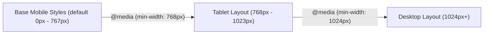

# CSS3 Transforms, Transitions, Keyframe Animations & Responsive Media Queries

[← Back to Course README](../README.md)

- [1. Theoretical & Front-End Foundations](#1-theoretical-front-end-foundations)
- [2. 2D & 3D CSS Transforms](#2-2d-3d-css-transforms)
- [3. Keyframe Animations & Responsive Media Queries Code](#3-keyframe-animations-responsive-media-queries-code)
- [4. 5 Solved Practice Questions & Conceptual Problems](#4-5-solved-practice-questions-conceptual-problems)
  - [Question 1: Transform vs Margin Layout Repaint Performance](#question-1-transform-vs-margin-layout-repaint-performance)
  - [Question 2: CSS Transition Shorthand Property Breakdown](#question-2-css-transition-shorthand-property-breakdown)
  - [Question 3: @font-face Custom Font Loading](#question-3-font-face-custom-font-loading)
  - [Question 4: Responsive Media Query Breakpoint Logic](#question-4-responsive-media-query-breakpoint-logic)
  - [Question 5: Multi-column CSS Layout Code](#question-5-multi-column-css-layout-code)

> **Topic**: 2D/3D Transforms (`transform: rotate() scale() translate() perspective()`), Transitions (`transition: all 0.3s ease-in-out`), Keyframe Animations (`@keyframes`), Web Fonts (`@font-face`), Multi-column Layouts, and Responsive Media Queries (`@media screen and (max-width: 768px)`).

---

## 1. Theoretical & Front-End Foundations

CSS3 enables hardware-accelerated visual motion effects (**Transforms** and **Transitions**) and fluid multi-device layouts (**Media Queries**).



---

## 2. 2D & 3D CSS Transforms

- `transform: translate(x, y)`: Repositions element without altering surrounding document layout.
- `transform: rotate(angle)`: Rotates element clockwise around transform-origin.
- `transform: scale(sx, sy)`: Resizes element dimensions.
- `transform: perspective(n) rotateY(angle)`: Enables 3D depth perception.

---

## 3. Keyframe Animations & Responsive Media Queries Code

```css
/* Responsive Layout with CSS Transitions & Animations */
.card {
    transition: transform 0.3s ease, box-shadow 0.3s ease;
}
.card:hover {
    transform: translateY(-8px) scale(1.02);
    box-shadow: 0 12px 24px rgba(0,0,0,0.2);
}

@keyframes pulse {
    0% { transform: scale(1); opacity: 1; }
    50% { transform: scale(1.1); opacity: 0.8; }
    100% { transform: scale(1); opacity: 1; }
}

@media screen and (max-width: 768px) {
    .container {
        flex-direction: column;
        padding: 10px;
    }
}
```

---

## 4. 5 Solved Practice Questions & Conceptual Problems

### Question 1: Transform vs Margin Layout Repaint Performance
**Problem**: Why is moving an element with `transform: translate(x, y)` more performant than moving it with `margin-left` or `top`?

**Solution**: Changing `top` or `margin` triggers browser **Layout** recalculation and **Reflow/Repaint** on the CPU. `transform: translate()` bypasses Layout and Reflow, offloading the element composite layer directly to the **GPU** hardware accelerator.

### Question 2: CSS Transition Shorthand Property Breakdown
**Problem**: Explain `transition: transform 0.4s cubic-bezier(0.25, 0.1, 0.25, 1) 0.1s;`.

**Solution**:
- `transform`: CSS property to transition.
- `0.4s`: Transition duration ($400\text{ ms}$).
- `cubic-bezier(...)`: Timing function (custom acceleration curve).
- `0.1s`: Transition delay before motion begins ($100\text{ ms}$).

### Question 3: @font-face Custom Font Loading
**Problem**: Write a `@font-face` rule to load custom font `RobotoCustom.woff2`.

**Solution**:
```css
@font-face {
    font-family: 'RobotoCustom';
    src: url('fonts/RobotoCustom.woff2') format('woff2'),
         url('fonts/RobotoCustom.woff') format('woff');
    font-weight: 400;
    font-style: normal;
    font-display: swap;
}
```

### Question 4: Responsive Media Query Breakpoint Logic
**Problem**: Write media queries implementing a Mobile-First responsive design strategy for Mobile ($< 768\text{px}$), Tablet ($768\text{px} - 1023\text{px}$), and Desktop ($\ge 1024\text{px}$).

**Solution**:
```css
/* Base Mobile Styles */
.col { width: 100%; }

/* Tablet Breakpoint */
@media screen and (min-width: 768px) {
    .col { width: 50%; }
}

/* Desktop Breakpoint */
@media screen and (min-width: 1024px) {
    .col { width: 33.33%; }
}
```

### Question 5: Multi-column CSS Layout Code
**Problem**: Divide a text container into 3 columns with a $20\text{px}$ gap and a $1\text{px}$ solid gray rule separator.

**Solution**:
```css
.article-text {
    column-count: 3;
    column-gap: 20px;
    column-rule: 1px solid #ccc;
}
```
