# JavaScript Engine, Client-Side Architecture, Variables, and Error Handling

[← Back to Course README](../README.md)

- [1. Client-Side Scripting Architecture, Evolution, and AJAX](#1-client-side-scripting-architecture-evolution-and-ajax)
- [2. Java vs JavaScript Differences and Language Quirks](#2-java-vs-javascript-differences-and-language-quirks)
- [3. Script Placement Options (Inline, Embedded, External)](#3-script-placement-options-inline-embedded-external)
- [4. Variable Declarations (`var`, `let`, `const`, Automatic) and Identifier Rules](#4-variable-declarations-var-let-const-automatic-and-identifier-rules)
- [5. Comparison Operators, Type Coercion, and Strict Equality](#5-comparison-operators-type-coercion-and-strict-equality)
- [6. Control Flow (Conditionals, Ternary Operator, `while` and `for` Loops)](#6-control-flow-conditionals-ternary-operator-while-and-for-loops)
- [7. Functions, Alerts, Debugging Logs, and Exception Handling (`try-catch-throw`)](#7-functions-alerts-debugging-logs-and-exception-handling-try-catch-throw)
- [8. 8 Solved Practice Questions and Exam Solutions](#8-8-solved-practice-questions-and-exam-solutions)

---

## 1. Client-Side Scripting Architecture, Evolution, and AJAX

### A. Client-Side Scripting Benefits and Challenges
Client-side scripting executes code directly within the user's web browser rendering engine (V8, SpiderMonkey).

```mermaid
flowchart TD
    subgraph SynchronousLoop ["Legacy Synchronous Request-Response Loop"]
        User1["User Action"] --> Req1["HTTP Request Sent to Remote Server"]
        Req1 --> Wait1["Full Page Reload & Wait for Render"]
    end
    
    subgraph AJAXLoop ["Modern Asynchronous AJAX Architecture"]
        User2["User Action"] --> JS["Client JavaScript (AJAX)"]
        JS --> AsyncReq["Asynchronous XMLHttpRequest / Fetch"]
        AsyncReq --> Server["Web Server / API"]
        Server --> AsyncRes["JSON / Data Response"]
        AsyncRes --> DOM["Dynamic DOM Update Without Full Reload"]
    end
```



#### Advantages of Client-Side Scripting:
1. **Server Offloading**: Computations are offloaded to client machines, reducing server CPU and memory load.
2. **Rapid User Event Response**: Immediate DOM updates eliminate latency from full-page reloads.
3. **Rich Desktop-Like User Interfaces**: Enables dynamic interactive web applications.

#### Challenges of Client-Side Scripting:
1. **JavaScript Disabled**: Clients may disable script execution for security.
2. **Cross-Browser Idiosyncrasies**: Variations across browser engines require thorough compatibility testing.
3. **Debugging Complexity**: Large client-side codebases can become complex to maintain.

### B. History of JavaScript and ECMAScript
- Created by Brendan Eich at Netscape in 1996 (originally named **LiveScript**).
- Standardized under **ECMAScript (ES)** specification.
- In the mid-2000s, **AJAX (Asynchronous JavaScript And XML)** revolutionized web development by allowing web pages to request data asynchronously in the background.

---

## 2. Java vs JavaScript Differences and Language Quirks

Despite sharing the name "Java", **Java** and **JavaScript** are completely distinct programming languages.

| Characteristic / Feature | Java Programming Language | JavaScript Scripting Language |
| :--- | :--- | :--- |
| **Execution Environment** | Compiled bytecode running on Java Virtual Machine (JVM). | Interpreted / JIT-compiled directly inside web browser. |
| **Type System** | Statically typed (`int x = 5;`). | Dynamically / Weakly typed (`let x = 5; x = "hello";`). |
| **Object Orientation** | Class-based object orientation. | Prototype-based object orientation. |
| **Use Cases** | Enterprise backend servers, Android apps, desktop software. | Client-side web interactivity, DOM manipulation, Node.js. |

### JavaScript Syntactic Quirks & Gotchas
1. **Case Sensitivity**: Identifiers, variables, function names, and keywords are strictly case-sensitive.
2. **Type Coercion & Strict Equality**: Loose equality (`==`) coerces operand types, while strict equality (`===`) checks both value and type without coercion.
3. **Single Numeric Type**: All numbers are 64-bit IEEE-754 floating-point numbers (`number`). Floating-point rounding errors can occur even with integer operations (`0.1 + 0.2 !== 0.3`).
4. **`null` vs `undefined`**: `undefined` means a variable has been declared but not assigned a value; `null` is an explicit assignment representing an intentional absence of object value.
5. **Block Scoping**: Legacy `var` declarations ignore block boundaries (`{}`) and are function-scoped; modern `let` and `const` enforce strict block scoping.

---

## 3. Script Placement Options (Inline, Embedded, External)

JavaScript logic can be integrated into HTML documents in three locations:

```html
<!-- 1. Inline JavaScript (HTML event attribute - Discouraged for maintenance) -->
<button onclick="alert('Inline execution!')">Click Me</button>

<!-- 2. Embedded JavaScript (<script> tag inside <head> or <body>) -->
<script>
  function greet() {
    alert("Hello from embedded script!");
  }
</script>

<!-- 3. External JavaScript (Linked via <script src="..."> - Recommended Best Practice) -->
<!-- Full URL Reference -->
<script src="https://cdn.example.com/js/app.js"></script>

<!-- Root Reference -->
<script src="/js/script.js"></script>

<!-- Relative File Path Reference -->
<script src="script.js"></script>
```

---

## 4. Variable Declarations (`var`, `let`, `const`, Automatic) and Identifier Rules

JavaScript variables act as named containers for storing data values.

### A. Identifier Naming Rules
1. Must begin with a letter (`a-z`, `A-Z`), underscore (`_`), or dollar sign (`$`).
2. Subsequent characters can include letters, digits (`0-9`), underscores, or `$`.
3. Cannot use reserved keywords (e.g. `function`, `class`, `return`).
4. Identifiers are case-sensitive (`myVar` and `myvar` are distinct).

### B. Four Ways to Declare Variables

```javascript
// 1. Automatic Declaration (Undeclared global assignment - Bad Practice)
x = 1;
y = 2;
z = x + y; // z = 3

// 2. var Keyword (Function-scoped, Hoisted with undefined)
var age = 25;
var age = 30; // Allowed: re-declaration in same scope

// 3. let Keyword (Block-scoped, Cannot be re-declared in same block)
let score = 100;
// let score = 200; // SyntaxError: Identifier 'score' has already been declared
score = 150; // Allowed: re-assignment

// 4. const Keyword (Block-scoped, Immutable binding)
const PI = 3.14159;
// PI = 3.14; // TypeError: Assignment to constant variable.
```

---

## 5. Comparison Operators, Type Coercion, and Strict Equality

| Operator | Meaning | Example (`x = 5`) | Evaluated Result |
| :--- | :--- | :--- | :--- |
| **`==`** | Loose Equality (With Type Coercion) | `x == "5"` | **`true`** (String `"5"` coerced to number `5`). |
| **`===`** | Strict Equality (No Type Coercion) | `x === "5"` | **`false`** (Number `5` !== String `"5"`). |
| **`!=`** | Loose Inequality | `x != "5"` | **`false`**. |
| **`!==`** | Strict Inequality | `x !== "5"` | **`true`**. |
| **`<`**, **`>`** | Less Than, Greater Than | `x > 10` | **`false`**. |
| **`<=`**, **`>=`** | Less/Greater Than or Equal | `x <= 5` | **`true`**. |

```javascript
// Strict Equality Examples
console.log(5 === 5);       // true (same number value and type)
console.log(5 === '5');     // false (number vs string)
console.log(0 === false);   // false (number vs boolean)
console.log(null === undefined); // false (object vs undefined)
```

---

## 6. Control Flow (Conditionals, Ternary Operator, `while` and `for` Loops)

### A. Conditionals and Ternary Operator

```javascript
let age = 18;

// Standard if-else structure
if (age < 18) {
    console.log("Minor");
} else {
    console.log("Adult");
}

// Ternary Operator: (condition) ? exprIfTrue : exprIfFalse
let voteable = (age >= 18) ? "Old enough to vote" : "Too young to vote";
console.log(voteable);
```

### B. Iteration Loops (`while` and `for`)

```javascript
// 1. While Loop
let i = 0; // Loop control variable initialization
while (i < 5) { // Condition evaluation
    console.log(`While Count: ${i}`);
    i++; // Increment loop control variable
}

// 2. For Loop (Initialization; Condition; Post-loop operation)
for (let j = 0; j < 5; j++) {
    console.log(`For Count: ${j}`);
}
```

---

## 7. Functions, Alerts, Debugging Logs, and Exception Handling (`try-catch-throw`)

### A. Modular Functions

```javascript
// Function definition (No return type or parameter type declarations required)
function power(base, exponent) {
    let result = 1;
    for (let i = 0; i < exponent; i++) {
        result *= base;
    }
    return result;
}

console.log(power(2, 10)); // Output: 1024
```

### B. Alerts vs Console Logging
- **`alert("Message")`**: Displays a blocking modal dialog box. Tedious for debugging.
- **`console.log("Message")`**: Writes non-blocking output messages directly to the browser Developer Console.

### C. Exception Handling with `try...catch...throw`

```javascript
function checkPalindrome(str) {
    try {
        // Throw custom exception for blank input
        if (str.trim() === "") {
            throw "Error: Input string cannot be left blank.";
        }
        // Throw custom exception for numeric input
        if (!isNaN(str)) {
            throw "Error: Numbers are invalid! Enter text words only.";
        }

        let reversed = str.split('').reverse().join('');
        return str === reversed;
    } catch (error) {
        console.error("Exception Caught: " + error);
        return false;
    }
}
```

---

## 8. 8 Solved Practice Questions and Exam Solutions

### Question 1: Difference Between `==` and `===` Operators
- **`==` (Loose Equality)**: Performs implicit type coercion on operands before comparing values (`5 == "5"` is `true`).
- **`===` (Strict Equality)**: Compares both value AND data type without coercion (`5 === "5"` is `false`).

### Question 2: Scoping Differences Between `var` and `let`
- **`var`**: Function-scoped or globally scoped. Ignores block boundaries (`{}`) and can be re-declared in the same scope.
- **`let`**: Block-scoped. Cannot be accessed outside its declaring `{}` block and cannot be re-declared within the same block.

### Question 3: Advantages of Client-Side Scripting
1. Offloads computation from backend server to client machines, reducing server load.
2. Provides immediate feedback to user events without requiring full-page reloads.
3. Enables dynamic DOM tree manipulation to create desktop-like user interfaces.

### Question 4: How AJAX Improves Web Application UX
AJAX allows web pages to send and receive data asynchronously from web servers in the background. This allows specific portions of a web page to update dynamically without forcing a full page refresh.

### Question 5: `null` vs `undefined` Distinction
- **`undefined`**: Indicates a variable has been declared but has not yet been assigned a value.
- **`null`**: An explicit assignment representing the intentional absence of any object value.

### Question 6: Output of `'5' + 3` vs `'5' - 3`
- `'5' + 3`: Evaluates to **`'53'`** (Binary `+` with a string operand performs string concatenation).
- `'5' - 3`: Evaluates to **`2`** (Numeric `-` operator coerces the string `'5'` to number `5`).

### Question 7: Purpose of `try...catch...throw`
- `try`: Encloses code blocks that may potentially generate runtime errors.
- `catch`: Catches and handles thrown exceptions to prevent script execution crashes.
- `throw`: Interrupts normal program flow to generate custom user-defined error messages.

### Question 8: Why Is Floating-Point Arithmetic Imprecise in JS?
JavaScript stores all numbers as 64-bit IEEE-754 double-precision floating-point numbers (`number`). Binary representation of certain decimal fractions (like `0.1` and `0.2`) creates repeating binary fractions, resulting in rounding discrepancies (`0.1 + 0.2 === 0.30000000000000004`).
