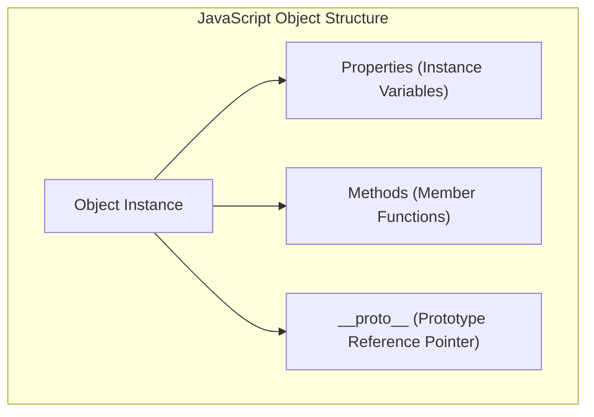
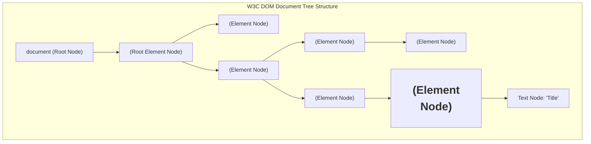
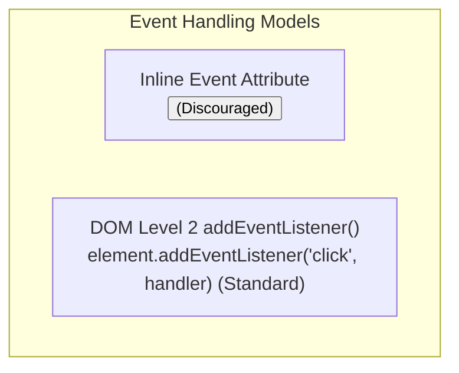

# JavaScript Objects, DOM Manipulation, Browser Events, and Form Validation

[← Back to Course README](../README.md)

- [1. JavaScript Object-Oriented Prototype Architecture](#1-javascript-object-oriented-prototype-architecture)
- [2. Standard Built-in Objects (`Array`, `Math`, `String`, `Date`, `Window`)](#2-standard-built-in-objects-array-math-string-date-window)
- [3. Document Object Model Architecture and Node Taxonomy](#3-document-object-model-architecture-and-node-taxonomy)
- [4. DOM Selection, Manipulation, and Dynamic Element Creation](#4-dom-selection-manipulation-and-dynamic-element-creation)
- [5. Modifying CSS Styles (`style`, `className`, and `classList` API)](#5-modifying-css-styles-style-classname-and-classlist-api)
- [6. JavaScript Event Engine (Mouse, Keyboard, Form, Frame Events)](#6-javascript-event-engine-mouse-keyboard-form-frame-events)
- [7. Client-Side Form Pre-Validation and Form Submission Control](#7-client-side-form-pre-validation-and-form-submission-control)
- [8. 8 Solved Practice Questions and Exam Solutions](#8-8-solved-practice-questions-and-exam-solutions)

---

## 1. JavaScript Object-Oriented Prototype Architecture

JavaScript is a prototype-based object-oriented scripting language. Unlike traditional class-based languages (such as Java or C#), objects in JavaScript inherit properties and methods directly from prototype objects.



### Constructors, Properties, and Methods
1. **Constructors**: Instantiated using the `new` keyword or shortcut literal constructors:
   ```javascript
   // Long form constructor
   let greet = new String("Hello");
   let numbers = new Array(1, 2, 3);

   // Shortcut literal constructor (Recommended)
   let str = "Hello";
   let arr = [1, 2, 3];
   ```
2. **Properties**: Accessed using dot notation (`object.property`).
3. **Methods**: Functions associated with object instances (`object.method()`).

---

## 2. Standard Built-in Objects (`Array`, `Math`, `String`, `Date`, `Window`)

| Object | Type | Primary Responsibilities | Key Properties & Methods |
| :--- | :--- | :--- | :--- |
| **`Array`** | Dynamic List | Stores ordered lists of values; resizable dynamically. | `length`, `push()`, `pop()`, `shift()`, `concat()`, `slice()`, `join()`, `reverse()`, `sort()`. |
| **`Math`** | Static Utility | Mathematical functions and mathematical constants. | `Math.PI`, `Math.E`, `Math.sqrt()`, `Math.pow()`, `Math.max()`, `Math.min()`, `Math.random()`. |
| **`String`** | Primitive Wrapper | String manipulation and pattern searching. | `length`, `charAt()`, `indexOf()`, `split()`, `search()`, `match()`, `concat()`. |
| **`Date`** | Chronological | Calculates current date/time and formats dates. | `toString()`, `getFullYear()`, `getMonth()`, `getDate()`, `getTime()`. |
| **`Window`** | Global Browser Environment | Represents the browser window/frame root. | `alert()`, `prompt()`, `confirm()`, `open()`, `history`, `location`, `document`. |

```javascript
// Array Traversal & Manipulation Example
let fruits = ["Apple", "Banana"];
fruits.push("Cherry"); // Add to back
let first = fruits[0]; // Access by index
console.log(`Array Length: ${fruits.length}`); // 3

// Math Static Class Operations
let radius = 5;
let area = Math.PI * Math.pow(radius, 2);
console.log(`Circle Area: ${area.toFixed(2)}`); // 78.54
```

---

## 3. Document Object Model Architecture and Node Taxonomy

The **Document Object Model (DOM)** is a platform- and language-neutral W3C programming interface (API) that allows JavaScript to dynamically access, update, and manipulate HTML document content, structure, and style.



### DOM Node Types & Navigation Properties
Every item in the DOM tree is a **Node**:
1. **Element Nodes** (`nodeType === 1`): Represent HTML elements (`<div>`, `<p>`).
2. **Attribute Nodes** (`nodeType === 2`): Represent element attributes (`id="main"`).
3. **Text Nodes** (`nodeType === 3`): Represent raw text inside HTML tags.

#### Essential Node Navigation Properties:
- `parentNode`: Returns parent node of current node.
- `childNodes`: Returns a `NodeList` collection of child nodes.
- `firstChild` / `lastChild`: Accesses first or last child node.
- `nextSibling` / `previousSibling`: Accesses adjacent sibling nodes.
- `nodeName` / `nodeType` / `nodeValue`: Inspection properties.

---

## 4. DOM Selection, Manipulation, and Dynamic Element Creation

### A. Element Selection API

| Selection Method | Return Type | Target Matching Criteria |
| :--- | :--- | :--- |
| `document.getElementById("id")` | Single Element Node | Matches element with exact `id`. |
| `document.getElementsByTagName("tag")` | Live `HTMLCollection` | Matches all elements with given tag name (e.g. `"p"`). |
| `document.getElementsByClassName("cls")` | Live `HTMLCollection` | Matches all elements with given CSS class name. |
| `document.querySelector("selector")` | Single Element Node | Matches **first** element matching CSS selector (`"#main .title"`). |
| `document.querySelectorAll("selector")` | Static `NodeList` | Matches **all** elements matching CSS selector. |

### B. Element Creation and Node Mutation API

```javascript
// 1. Create a new <p> element node
const newParagraph = document.createElement("p");

// 2. Create and attach text content
newParagraph.textContent = "Dynamic paragraph created via JavaScript DOM API.";

// 3. Append new element to container
const container = document.getElementById("container");
container.appendChild(newParagraph);

// 4. Replace an existing child element
const replacementPara = document.createElement("p");
replacementPara.textContent = "Replacement paragraph text.";
const oldPara = document.getElementById("para1");
container.replaceChild(replacementPara, oldPara);

// 5. Remove a child element
const targetPara = document.getElementById("para2");
container.removeChild(targetPara);
```

---

## 5. Modifying CSS Styles (`style`, `className`, and `classList` API)

JavaScript can alter element styling dynamically using three approaches:

```javascript
const box = document.getElementById("boxElement");

// 1. Direct Inline Style Modification (camelCase property names)
box.style.backgroundColor = "#ff0000";
box.style.borderWidth = "3px";

// 2. Overwriting CSS Class Name via className
box.className = "card-active";

// 3. Modern classList API (Recommended Best Practice)
box.classList.add("highlight");    // Add class
box.classList.remove("inactive"); // Remove class
box.classList.toggle("selected"); // Toggle class state
```

---

## 6. JavaScript Event Engine (Mouse, Keyboard, Form, Frame Events)

Events represent actions or occurrences detected by browser JavaScript engines.



### A. Event Categories Taxonomy

| Event Category | Event Name | Triggering Condition |
| :--- | :--- | :--- |
| **Mouse** | `click` | Primary mouse button clicked on element. |
| **Mouse** | `dblclick` | Mouse double-clicked on element. |
| **Mouse** | `mousedown` / `mouseup` | Mouse button pressed down / released. |
| **Mouse** | `mouseover` / `mouseout` | Mouse cursor enters / leaves element boundary. |
| **Keyboard** | `keydown` | User presses a keyboard key (Triggers first). |
| **Keyboard** | `keypress` | User holds down a character key (Triggers second). |
| **Keyboard** | `keyup` | User releases a keyboard key (Triggers last). |
| **Form** | `focus` / `blur` | Form control receives focus / loses focus. |
| **Form** | `change` | Value of `<input>`, `<select>`, or `<textarea>` changes. |
| **Form** | `submit` | User submits an HTML `<form>`. |
| **Frame / Window** | `load` | Document or image finishes loading in memory (`window.onload`). |
| **Frame / Window** | `resize` / `scroll` | Browser window is resized / page view is scrolled. |

### B. Standard `addEventListener()` Syntax

```javascript
// Attach event listener using anonymous function
const btn = document.getElementById("submitBtn");

btn.addEventListener("click", function(event) {
    event.preventDefault(); // Block default form submission
    alert("Button clicked via Event Listener!");
});
```

---

## 7. Client-Side Form Pre-Validation and Form Submission Control

Pre-validating form inputs on the client side improves user experience and prevents sending corrupt data to backend servers.

```javascript
document.getElementById("registrationForm").addEventListener("submit", function(event) {
    // 1. Access form input nodes
    const usernameInput = document.getElementById("username");
    const termsCheckbox = document.getElementById("terms");
    const ageInput = document.getElementById("age");

    // 2. Validate Empty Text Input
    if (usernameInput.value.trim() === "") {
        alert("Error: Username cannot be blank!");
        usernameInput.focus();
        event.preventDefault(); // Stop submission
        return;
    }

    // 3. Validate Checkbox Agreement
    if (!termsCheckbox.checked) {
        alert("Error: You must accept the terms of service!");
        event.preventDefault(); // Stop submission
        return;
    }

    // 4. Validate Numeric Range
    let ageVal = parseInt(ageInput.value, 10);
    if (isNaN(ageVal) || ageVal < 18) {
        alert("Error: You must be at least 18 years old.");
        event.preventDefault(); // Stop submission
        return;
    }

    // Validation passed: Allow form to submit to server
});
```

---

## 8. 8 Solved Practice Questions and Exam Solutions

### Question 1: Inline Event Handlers vs `addEventListener()`
- **Inline Event Handlers** (`onclick="..."` in HTML tags) weave presentation markup with programming behavior, violating separation of concerns.
- **`addEventListener()`** keeps HTML clean, allows attaching multiple listeners to a single event, and supports anonymous functions and options.

### Question 2: Difference Between `innerHTML` and `textContent`
- **`innerHTML`**: Reads or writes HTML tags and markup text. Susceptible to Cross-Site Scripting (XSS) attacks if used with unsanitized user input.
- **`textContent`**: Reads or writes plain unparsed text only, automatically escaping HTML tags for safe output.

### Question 3: Purpose of `window.onload` or `DOMContentLoaded`
Attempting to select DOM elements before the page HTML has loaded results in `null` reference errors. `window.onload` or `DOMContentLoaded` delays script execution until DOM tree nodes are instantiated in memory.

### Question 4: How `createElement()` and `appendChild()` Work
1. `document.createElement("div")` instantiates a new Element Node in memory.
2. `parent.appendChild(newChild)` attaches the newly created node as the last child of `parent`.

### Question 5: Keyboard Event Firing Sequence
When a key is pressed, the event sequence fires as follows:
1. **`keydown`** (Fires first when key is depressed)
2. **`keypress`** (Fires second while key is held)
3. **`keyup`** (Fires last when key is released)

### Question 6: Purpose of `event.preventDefault()` in Form Validation
`event.preventDefault()` cancels the browser's default event behavior (e.g. submitting an HTTP form request or following a hyperlink), allowing custom client-side validation to execute first.

### Question 7: `className` vs `classList` API
- **`className`**: Replaces the entire string of CSS classes on an element (`element.className = "newClass"`).
- **`classList`**: Offers fine-grained control to add (`classList.add()`), remove (`classList.remove()`), or toggle (`classList.toggle()`) individual CSS classes without overwriting existing classes.

### Question 8: Accessing Form Radio Button and Checkbox State
- **Checkbox**: Check `element.checked` boolean property (`true` if checked, `false` if unchecked).
- **Radio Button Group**: Iterate over inputs with shared `name` attribute and evaluate `radio.checked`.
