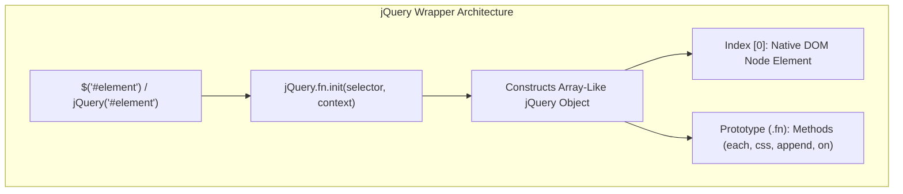
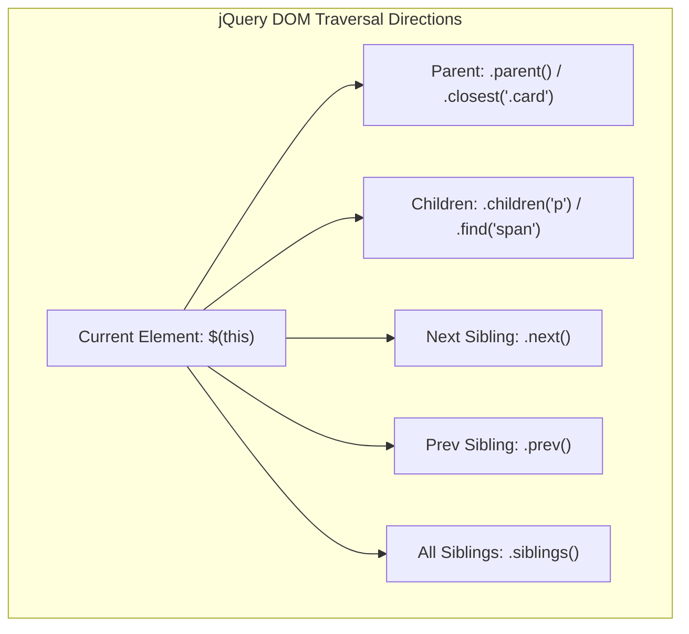

# jQuery Architecture, Selectors, Attributes, Document Ready, and DOM Manipulation

[← Back to Course README](../README.md)

- [1. Getting Started, Namespace Collisions, and jQuery Object Architecture](#1-getting-started-namespace-collisions-and-jquery-object-architecture)
- [2. jQuery Selectors Taxonomy, Combinators, and Selector Caching](#2-jquery-selectors-taxonomy-combinators-and-selector-caching)
- [3. Attributes and Properties Management (`attr()` vs `prop()`)](#3-attributes-and-properties-management-attr-vs-prop)
- [4. The Document-Ready Event Engine (`$(document).ready()` vs `$(window).load()`)](#4-the-document-ready-event-engine-documentready-vs-windowload)
- [5. DOM Traversal API (`children()`, `next()`, `prev()`, `filter()`, `find()`, `closest()`)](#5-dom-traversal-api-children-next-prev-filter-find-closest)
- [6. DOM Insertion and Modification (`append()`, `prepend()`, `DocumentFragment`)](#6-dom-insertion-and-modification-append-prepend-documentfragment)
- [7. Executable Code: Dynamic Table Builder with Selector Caching](#7-executable-code-dynamic-table-builder-with-selector-caching)
- [8. 8 Solved Practice Questions and Exam Solutions](#8-8-solved-practice-questions-and-exam-solutions)

---

## 1. Getting Started, Namespace Collisions, and jQuery Object Architecture

### A. What is jQuery?
**jQuery** is a fast, small, and feature-rich JavaScript library. It wraps raw DOM elements in a prototype-extended **jQuery Object**, providing cross-browser abstractions for DOM manipulation, event handling, animation, and AJAX.



### B. Avoiding Namespace Collisions (`jQuery.noConflict`)
Other JavaScript libraries (such as Prototype or MooTools) also use `$` as an alias. jQuery provides `jQuery.noConflict()` to relinquish control of `$`:

```javascript
// 1. Release $ alias back to other libraries
jQuery.noConflict();
jQuery('#hello').text('Hello World!');

// 2. Assign custom alias
var $j = jQuery.noConflict();
$j('#hello').text('Hello World!');

// 3. Prevent collisions using an Immediately Invoked Function Expression (IIFE)
(function($) {
    $(document).ready(function() {
        $('#hello').text('Hello World!');
    });
})(jQuery);

// 4. Secure $ alias inside document ready handler
jQuery(function($) {
    $('#hello').text('Hello World!');
});
```

---

## 2. jQuery Selectors Taxonomy, Combinators, and Selector Caching

### A. Selectors Matrix

| Selector Category | jQuery Syntax | Target Matching Description |
| :--- | :--- | :--- |
| **All Elements** | `$("*")` | Matches every element in the DOM tree. |
| **Type Selector** | `$("div")` | Matches all `<div>` elements. |
| **Class Selector** | `$(".blue")` | Matches elements with `class="blue"`. |
| **Multi-Class (AND)**| `$(".blue.red")` | Matches elements having **both** `blue` AND `red` classes. |
| **Group Selector (OR)**| `$(".blue, .red")` | Matches elements with `blue` OR `red` class. |
| **ID Selector** | `$("#headline")` | Matches unique element with `id="headline"`. |
| **Attribute Presence**| `$("[href]")` | Matches elements possessing an `href` attribute. |
| **Attribute Value** | `$("[href='example.com']")` | Matches elements whose `href` equals `'example.com'`. |
| **Indexed Selector** | `$("a:eq(1)")` | Matches the 2nd `<a>` element (0-indexed). |
| **Indexed Exclusion**| `$("a:not(:eq(0))")` | Matches all `<a>` elements except the 1st one. |

### B. Relational Combinators
- **Descendant** (`$("div span")`): Matches all `<span>` descendants inside `<div>`.
- **Direct Child** (`$("div > span")`): Matches `<span>` elements that are direct children of `<div>`.
- **Adjacent Sibling** (`$("a + span")`): Matches `<span>` immediately following an `<a>`.
- **General Sibling** (`$("a ~ span")`): Matches all `<span>` siblings following an `<a>`.

### C. Caching Selectors for Performance
Every time `$()` is executed, jQuery searches the DOM tree. Repeatedly calling `$()` inside loops degrades application speed. Always cache selections into variables:

```javascript
// BAD PRACTICE: Repeated DOM traversal
$('#navigation').show();
$('#navigation').addClass('active');

// GOOD PRACTICE: Cache selector in variable (convention uses $ prefix)
var $nav = $('#navigation');
$nav.show();
$nav.addClass('active');
```

---

## 3. Attributes and Properties Management (`attr()` vs `prop()`)

| Method | Functionality | Primary Use Cases |
| :--- | :--- | :--- |
| **`.attr()`** | Gets or sets HTML attributes directly from DOM markup (`getAttribute` / `setAttribute`). | String attributes (`src`, `href`, `title`, `alt`, `data-*`). |
| **`.prop()`** | Gets or sets DOM element properties directly on JavaScript object nodes. | Boolean DOM state properties (`checked`, `disabled`, `selected`, `readOnly`). |

```javascript
// Setting and Getting Attributes vs Properties
$('a').attr('href', '/home'); // Sets href attribute
let linkUrl = $('a').attr('href'); // Returns "/home"

// Setting Checkbox Checked State (Must use .prop())
$('#acceptTos').prop('checked', true); // Correct
$('#acceptTos').attr('checked', 'checked'); // Inconsistent cross-browser behavior

// Removing Attributes and Properties
$('#homeLink').removeAttr('title');
$('#acceptTos').removeProp('checked');

// HTML5 Data Attributes
let col = $('article').data('column'); // Accesses data-column attribute
```

---

## 4. The Document-Ready Event Engine (`$(document).ready()` vs `$(window).load()`)

### A. Document Ready Syntax Evolution
The document-ready handler ensures JavaScript code executes only after all HTML DOM elements have been rendered.

```javascript
// jQuery 3.0+ Recommended Standard Syntax
jQuery(function($) {
    // DOM is ready for manipulation
    $('#myDiv').text('Hello World!');
});

// Legacy Syntax (Equivalent in older jQuery versions)
$(document).ready(function() {
    $('#myDiv').text('Hello World!');
});
```

### B. Comparison: `$(document).ready()` vs `$(window).load()`

| Event | Trigger Condition | Asset Availability | Usage Recommendation |
| :--- | :--- | :--- | :--- |
| **`$(document).ready()`** | Fires as soon as HTML DOM tree nodes are parsed in memory. | DOM elements available; external images/iframes may still be downloading. | **Standard for all DOM manipulation script setup.** |
| **`$(window).load()`** | Fires after the entire page and all external resources (images, style sheets, media) have completed downloading. | All assets and image dimensions (`width`, `height`) fully loaded. | Deprecated in jQuery 1.8, removed in jQuery 3.0. Use native JS `window.onload`. |

---

## 5. DOM Traversal API (`children()`, `next()`, `prev()`, `filter()`, `find()`, `closest()`)

DOM traversal methods navigate through the DOM tree relative to a selected element.



### Traversal Methods Summary
- **`.children(selector)`**: Selects direct children of matched elements.
- **`.next(selector)` / `.prev(selector)`**: Gets immediately following or preceding sibling element.
- **`.siblings(selector)`**: Gets all sibling elements sharing the same parent.
- **`.find(selector)`**: Searches descendants across all nested levels down the DOM tree.
- **`.closest(selector)`**: Returns the first matching element starting from self and traversing **upward** through ancestor containers.
- **`.filter(selector / function)`**: Filters down matched set based on CSS selector or custom boolean function.

---

## 6. DOM Insertion and Modification (`append()`, `prepend()`, `DocumentFragment`)

### A. Insertion Methods Comparison

```html
<!-- Container Before Insertion -->
<div id="parent">
  <span>Existing Child</span>
</div>

<script>
// 1. .append() - Inserts content at END inside container
$('#parent').append('<div>Appended Child</div>');

// 2. .prepend() - Inserts content at BEGINNING inside container
$('#parent').prepend('<div>Prepended Child</div>');

// 3. .before() - Inserts sibling BEFORE container
$('#parent').before('<div>Sibling Before</div>');

// 4. .after() - Inserts sibling AFTER container
$('#parent').after('<div>Sibling After</div>');
</script>
```

### B. High-Performance Bulk Insertion Strategy
Repeatedly appending elements inside loops causes browser reflow and repaint performance penalties.

```javascript
// BAD PRACTICE: Appending inside loop (Forces 300 DOM reflows)
for (let i = 0; i < data.length; i++) {
    $('#table').append(`<tr><td>${data[i].name}</td></tr>`);
}

// GOOD PRACTICE: Build array or DocumentFragment, append once
let rowElements = data.map(function(row) {
    return `<tr><td>${row.name}</td></tr>`;
});
$('#table').append(rowElements.join('')); // Single DOM insertion
```

---

## 7. Executable Code: Dynamic Table Builder with Selector Caching

```html
<!DOCTYPE html>
<html lang="en">
<head>
  <meta charset="UTF-8">
  <title>jQuery DOM & Attribute Builder Demo</title>
  <script src="https://code.jquery.com/jquery-3.6.0.min.js"></script>
  <style>
    body { font-family: Arial, sans-serif; padding: 20px; background: #f4f6f9; }
    .card { background: white; padding: 20px; border-radius: 8px; max-width: 600px; margin: 0 auto; box-shadow: 0 4px 10px rgba(0,0,0,0.1); }
    table { width: 100%; border-collapse: collapse; margin-top: 15px; }
    th, td { border: 1px solid #ddd; padding: 8px; text-align: left; }
    th { background: #007acc; color: white; }
    tr.selected { background-color: #e6f2ff; font-weight: bold; }
    button { margin-top: 10px; padding: 8px 16px; background: #28a745; color: white; border: none; border-radius: 4px; cursor: pointer; }
  </style>
</head>
<body>

<div class="card">
  <h2>Student Grade Directory</h2>
  <button id="addStudentBtn">Add Sample Student</button>
  
  <table id="studentTable">
    <thead>
      <tr>
        <th>ID</th>
        <th>Student Name</th>
        <th>Grade</th>
        <th>Action</th>
      </tr>
    </thead>
    <tbody>
      <tr data-id="101">
        <td>101</td>
        <td>Alice Smith</td>
        <td>A</td>
        <td><button class="delete-btn">Delete</button></td>
      </tr>
    </tbody>
  </table>
</div>

<script>
jQuery(function($) {
    // Cache DOM references
    var $tableBody = $('#studentTable tbody');

    // 1. Dynamic Row Insertion
    $('#addStudentBtn').on('click', function() {
        var newId = Math.floor(Math.random() * 900) + 100;
        var newRow = `
          <tr data-id="${newId}">
            <td>${newId}</td>
            <td>New Student ${newId}</td>
            <td>B+</td>
            <td><button class="delete-btn">Delete</button></td>
          </tr>
        `;
        $tableBody.append(newRow);
    });

    // 2. Delegated Event Listener for Delete Action
    $tableBody.on('click', '.delete-btn', function() {
        var $row = $(this).closest('tr');
        $row.fadeOut(300, function() {
            $(this).remove();
        });
    });

    // 3. Row Selection Toggle using closest and toggleClass
    $tableBody.on('click', 'tr', function(e) {
        if (!$(e.target).is('button')) {
            $(this).toggleClass('selected').siblings().removeClass('selected');
        }
    });
});
</script>

</body>
</html>
```

---

## 8. 8 Solved Practice Questions and Exam Solutions

### Question 1: Difference Between `attr()` and `prop()`
- **`attr()`**: Accesses raw HTML string attributes from document markup (`getAttribute`/`setAttribute`).
- **`prop()`**: Accesses dynamic JavaScript object properties on DOM nodes (used for boolean states like `prop('checked', true)`).

### Question 2: Purpose of `jQuery.noConflict()`
`jQuery.noConflict()` releases the global `$` alias, preventing conflicts with other JavaScript libraries using `$`. The library remains accessible via `jQuery` or a custom alias (`var $j = jQuery.noConflict();`).

### Question 3: Difference Between `$(document).ready()` and `$(window).load()`
- `$(document).ready()` fires when the HTML DOM tree structure is fully parsed, allowing scripts to execute before images finish downloading.
- `$(window).load()` waited until all external resources (images, style sheets) finished downloading. Deprecated in 1.8 and removed in 3.0.

### Question 4: How `.closest('tr')` Differs From `.parents('tr')`
- **`.closest('tr')`**: Traverses **upward** through ancestor nodes starting from the current element, stopping at the **very first** matching ancestor.
- **`.parents('tr')`**: Traverses all the way up to the root document node, returning **all** matching ancestor elements.

### Question 5: Why Is Appending Elements in a Loop Inefficient?
Calling `.append()` inside a loop forces the browser rendering engine to re-calculate layout geometry (reflow) and repaint screen pixels on every single iteration.

### Question 6: Output of `$('#myDiv')[0]`
Accessing index `[0]` on a jQuery object returns the underlying raw **native HTML DOM Element node**, unwrapping it from the jQuery prototype API.

### Question 7: How `.filter()` Differs From `.find()`
- **`.find(selector)`**: Searches **downward** through descendant child elements across all nested tree levels.
- **`.filter(selector)`**: Filters the **current matched set** of elements, keeping only elements that meet the filter criteria.

### Question 8: Preferred jQuery 3.0 Document Ready Syntax
```javascript
jQuery(function($) {
    // Document ready logic here
});
```
