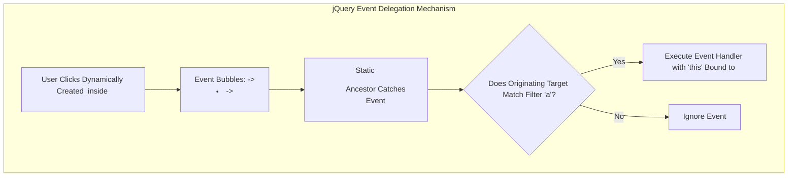
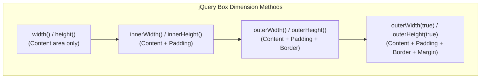

# jQuery Events, Delegated Handlers, Animation Engine, AJAX, and Plugin Development

[← Back to Course README](../README.md)

- [1. jQuery Event Delegation Engine (`.on()` vs `.off()`)](#1-jquery-event-delegation-engine-on-vs-off)
- [2. Event Namespaces and Accessing Original Native Events](#2-event-namespaces-and-accessing-original-native-events)
- [3. CSS Manipulation and Element Box Dimensions API](#3-css-manipulation-and-element-box-dimensions-api)
- [4. Built-in Effects, Custom `.animate()`, and Animation Queues](#4-built-in-effects-custom-animate-and-animation-queues)
- [5. Deferred Objects, Promises, and Asynchronous AJAX Requests](#5-deferred-objects-promises-and-asynchronous-ajax-requests)
- [6. AJAX Form Submission and File Uploads (`FormData`)](#6-ajax-form-submission-and-file-uploads-formdata)
- [7. jQuery Plugin Architecture Development (`$.fn`)](#7-jquery-plugin-architecture-development-fn)
- [8. 8 Solved Practice Questions and Exam Solutions](#8-8-solved-practice-questions-and-exam-solutions)

---

## 1. jQuery Event Delegation Engine (`.on()` vs `.off()`)

### A. Direct vs Delegated Event Listeners
When elements are added dynamically to a page after initial rendering, direct event listeners fail because target elements did not exist when event bindings were created.



#### Code Comparison:
```javascript
// 1. Direct Binding (FAILS for dynamically added <a> elements)
$('ul a').on('click', function() {
    console.log(this.href);
});

// 2. Delegated Event Binding (SUCCESS: Delegates event handling to static <ul> ancestor)
$('ul').on('click', 'a', function() {
    console.log(this.href); // `this` refers to the clicked <a> link
});
```

### B. Detaching Event Handlers (`.off()`)
```javascript
// Detach all click event handlers from button
$('#myBtn').off('click');

// Detach all event handlers (click, mouseenter, etc.) from button
$('#myBtn').off();
```

---

## 2. Event Namespaces and Accessing Original Native Events

### A. Event Namespacing
When multiple scripts or plugins attach event listeners to the same element, detaching generic event types (`$(document).off('click')`) accidentally removes handlers attached by third-party libraries. **Event Namespaces** allow detaching only your custom handlers:

```javascript
// Attach custom named event listeners
$(document).on('click.myModule', function() {
    console.log('Module Click Handler 1');
});

$(document).on('click.myModule', function() {
    console.log('Module Click Handler 2');
});

// Remove ONLY handlers bound under 'myModule' namespace
$(document).off('click.myModule'); // Leaves third-party click handlers intact
```

### B. Accessing `originalEvent`
jQuery normalizes browser event objects. To access native DOM properties not exposed directly by jQuery, use `event.originalEvent`:

```javascript
$(document).on('wheel', function(e) {
    // Access native mouse wheel deltaY property
    let delta = e.originalEvent.deltaY;
    console.log(`Scroll Delta: ${delta}`);
});
```

---

## 3. CSS Manipulation and Element Box Dimensions API

### A. CSS Getters and Setters

```javascript
// 1. CSS Getter (Returns computed string value, e.g. "150px")
let currentWidth = $('#box').css('width');

// 2. CSS Setter (Single property)
$('#box').css('color', '#007acc');

// 3. CSS Setter (Multiple properties object)
$('#box').css({
    'background-color': '#f8f9fa',
    'border': '2px solid #007acc',
    'font-size': '14pt'
});

// 4. Numeric Relative Increment / Decrement
$('#box').css('font-size', '+=2px');
$('#box').css('width', '-=50px');
```

### B. Element Box Dimensions API



---

## 4. Built-in Effects, Custom `.animate()`, and Animation Queues

### A. Built-in Visibility Effects

```javascript
// Display / Hide Toggles
$('#el').show(400);  // Display element over 400ms
$('#el').hide(400);  // Hide element (sets display: none)
$('#el').toggle();   // Toggle between show/hide

// Fading Effects
$('#el').fadeIn(300);              // Fade in opacity to 1.0
$('#el').fadeOut(300);             // Fade out opacity to 0 (sets display: none)
$('#el').fadeToggle(300);          // Toggle fading
$('#el').fadeTo(300, 0.5);         // Fade to specified opacity (preserves display)

// Sliding Effects
$('#el').slideDown(400);           // Slide down vertically
$('#el').slideUp(400);             // Slide up vertically
$('#el').slideToggle(400);         // Toggle sliding
```

### B. Custom `.animate()` and `.stop()` Control

```javascript
// Custom multi-property animation with completion callback
$('#box').animate({
    width: '300px',
    height: '300px',
    opacity: 0.8
}, 1000, 'linear', function() {
    console.log('Animation completed!');
});

// Preventing animation queue buildup on rapid user hover
$('#box').stop(true, true).animate({ width: '200px' }, 300);
// .stop(clearQueue, jumpToEnd):
// clearQueue = true: Clears pending queued animations.
// jumpToEnd = true: Immediately completes current animation transition.
```

---

## 5. Deferred Objects, Promises, and Asynchronous AJAX Requests

jQuery uses **Deferred Objects** and **Promises** to handle asynchronous tasks cleanly without deep callback nesting.

```javascript
// Creating a Custom Timer Promise with $.Deferred()
function waitPromise(ms) {
    let def = $.Deferred();
    setTimeout(function() {
        def.resolve("Timer Finished!"); // Resolve deferred object
    }, ms);
    return def.promise(); // Return promise interface
}

// Consuming Promise with .done(), .fail(), .always()
waitPromise(1000).done(function(message) {
    console.log(message);
});

// Modern $.ajax Request with Promise Handlers
$.ajax({
    url: '/api/data',
    type: 'GET',
    dataType: 'json'
})
.done(function(data) {
    console.log('Success:', data);
})
.fail(function(jqXHR, textStatus, errorThrown) {
    console.error('AJAX Error:', textStatus);
})
.always(function() {
    console.log('AJAX request completed.');
});
```

---

## 6. AJAX Form Submission and File Uploads (`FormData`)

### A. AJAX Form Submission with `serialize()`

```javascript
$('#contactForm').on('submit', function(e) {
    e.preventDefault(); // Stop page reload
    let $form = $(this);

    $.ajax({
        type: 'POST',
        url: $form.attr('action'),
        data: $form.serialize(), // Converts inputs to URL query string
        success: function(response) {
            $('#status').html('<p>Form submitted successfully!</p>');
        },
        error: function(jqXHR, textStatus) {
            $('#status').html('<p>Submission failed: ' + textStatus + '</p>');
        }
    });
});
```

### B. Asynchronous File Upload using `FormData`

```javascript
$('#fileUploadForm').on('submit', function(e) {
    e.preventDefault();
    let fileInput = document.getElementById('fileInput');
    let files = fileInput.files;
    let formData = new FormData();

    // Append selected files to FormData payload
    $.each(files, function(i, file) {
        formData.append('file_' + i, file);
    });
    formData.append('user', 'JohnDoe');

    $.ajax({
        url: '/upload',
        type: 'POST',
        data: formData,
        processData: false, // CRITICAL: Prevent jQuery from processing data into string
        contentType: false, // CRITICAL: Prevent jQuery from overriding multipart header
        success: function(response) {
            alert('File uploaded successfully!');
        }
    });
});
```

---

## 7. jQuery Plugin Architecture Development (`$.fn`)

You can extend the core jQuery library API by adding custom methods to `$.fn` (`jQuery.prototype`).

```javascript
// Custom Highlight Plugin Definition
(function($) {
    $.fn.highlight = function(options) {
        // Default plugin settings
        let settings = $.extend({
            color: '#000000',
            background: '#ffff00'
        }, options);

        // Maintain chainability by returning `this.each`
        return this.each(function() {
            $(this).css({
                color: settings.color,
                backgroundColor: settings.background
            });
        });
    };
})(jQuery);

// Plugin Usage Examples
$('span').highlight(); // Uses default yellow background
$('p').highlight({ background: '#ffcccc', color: '#990000' }); // Custom options
```

---

## 8. 8 Solved Practice Questions and Exam Solutions

### Question 1: How Event Delegation Works in jQuery
Event delegation relies on **event bubbling**. An event listener attached to a static parent element (`$('ul').on('click', 'a', fn)`) catches events bubbling up from child elements (`<a>`), filtering execution based on whether the originating target matches the selector.

### Question 2: Purpose of Event Namespaces (`click.myNamespace`)
Event namespaces allow developers to bind and unbind custom handlers (`$(document).off('click.myNamespace')`) without accidentally detaching other click event listeners attached by third-party plugins.

### Question 3: `.fadeOut()` vs `.fadeTo()`
- **`.fadeOut(300)`**: Animates opacity to `0` and sets `display: none` upon completion, removing element from document layout flow.
- **`.fadeTo(300, 0.5)`**: Animates opacity to a target value (`0.5`) without altering `display`, preserving layout space.

### Question 4: Difference Between `outerWidth()` and `outerWidth(true)`
- **`outerWidth()`**: Calculates width including `content + padding + border`.
- **`outerWidth(true)`**: Calculates width including `content + padding + border + margin`.

### Question 5: Why `processData: false` and `contentType: false` Are Required for File Uploads
- `processData: false`: Prevents jQuery from attempting to transform the binary `FormData` object into a URL-encoded string.
- `contentType: false`: Prevents jQuery from setting the default `application/x-www-form-urlencoded` header, allowing browser to automatically set `multipart/form-data` with boundaries.

### Question 6: Purpose of `.stop(true, true)` in Animations
`.stop(true, true)` clears the queued animation stack (`clearQueue=true`) and immediately completes current animation transition (`jumpToEnd=true`), preventing animation queuing lag on rapid user hover.

### Question 7: Legacy `.success()` vs Modern `.done()` Promises
Legacy `.success()` and `.error()` callbacks were deprecated in jQuery 1.8 and removed in 3.0. Modern jQuery uses standard Promise methods `.done()`, `.fail()`, and `.always()`.

### Question 8: How to Ensure Chainability in Custom jQuery Plugins
To preserve jQuery method chaining (e.g. `$('p').highlight().hide()`), plugin methods must return `this.each(...)`:
```javascript
$.fn.myPlugin = function() {
    return this.each(function() {
        // Plugin logic per element
    });
};
```
