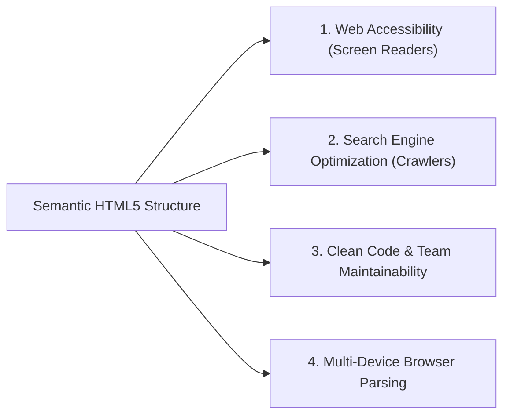
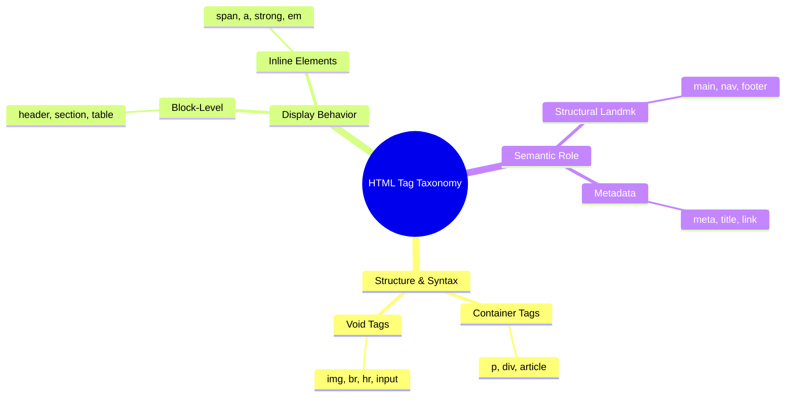

# Assignment 01 Solutions: Comprehensive HTML5, CSS3, and JavaScript

[← Back to Course README](../README.md)

- [1. Question 1: HTML Element Identification and HTML5 Semantic Tags](#1-question-1-html-element-identification-and-html5-semantic-tags)
- [2. Question 2: Complex Nested Ordered Lists with CSS Styling](#2-question-2-complex-nested-ordered-lists-with-css-styling)
- [3. Question 3: URL Referencing Techniques (Absolute vs Relative)](#3-question-3-url-referencing-techniques-absolute-vs-relative)
- [4. Question 4: Link Destinations and HTML List Types](#4-question-4-link-destinations-and-html-list-types)
- [5. Question 5: Importance of Semantic Structure in HTML5](#5-question-5-importance-of-semantic-structure-in-html5)
- [6. Question 6: Taxonomy and Types of HTML Tags](#6-question-6-taxonomy-and-types-of-html-tags)
- [7. Question 7: JavaScript Prime Number Checker (`IsPrime()`)](#7-question-7-javascript-prime-number-checker-isprime)
- [8. Question 8: JavaScript Palindrome Checker with Custom Exceptions](#8-question-8-javascript-palindrome-checker-with-custom-exceptions)
- [9. Question 9: Pixel-Perfect HTML5/CSS3 Sign-Up Form Implementation](#9-question-9-pixel-perfect-html5css3-sign-up-form-implementation)

---

## 1. Question 1: HTML Element Identification and HTML5 Semantic Tags

### Identification of HTML Elements
An **HTML Element** is the fundamental building block of an HTML document. It is identified by an **Opening Tag** (`<tagname>`), optional **Attributes** (e.g., `id="..."`, `class="..."`), the **Content** (text or nested child elements), and a **Closing Tag** (`</tagname>`).

$$\text{HTML Element} = \text{Opening Tag} + \text{Attributes} + \text{Content} + \text{Closing Tag}$$

```html
<!-- Example of HTML Element Structure -->
<p id="intro" class="highlight">Hello, World!</p>
```

### Examples of Specified HTML5 Semantic Tags

#### i) `<header>` and `<footer>`
- **`<header>`**: Represents introductory content, page/section headings, branding logos, or navigation links.
- **`<footer>`**: Represents the footer of a page or section, typically containing copyright statements, author info, or privacy policy links.

```html
<!DOCTYPE html>
<html lang="en">
<head>
  <meta charset="UTF-8">
  <title>Header & Footer Example</title>
</head>
<body>

  <!-- Header Element -->
  <header>
    <h1>Academic Portal</h1>
    <p>Welcome to the Computer Science Department</p>
  </header>

  <main>
    <p>Main course content goes here.</p>
  </main>

  <!-- Footer Element -->
  <footer>
    <p>&copy; 2026 International Centre for Applied Sciences. All Rights Reserved.</p>
  </footer>

</body>
</html>
```

#### ii) `<figure>` and `<figcaption>`
- **`<figure>`**: Specifies self-contained content such as illustrations, diagrams, photos, or code snippets.
- **`<figcaption>`**: Provides a visual and structural caption for its parent `<figure>` element.

```html
<!-- Figure and Figcaption Example -->
<figure>
  
  <figcaption>Figure 1.1: Star Network Topology Layout with Central Switch Node.</figcaption>
</figure>
```

---

## 2. Question 2: Complex Nested Ordered Lists with CSS Styling

**Problem**: Create an HTML document with nested ordered lists satisfying:
1. **Outer List**: Parents (Mother first). Background color: **Pink** (`#ffc0cb`). List style type: **Uppercase Roman Numerals** (`type="I"`).
2. **Middle Lists**: Uncles & Aunts (Brothers and sisters of each parent, eldest first). List style type: **Uppercase Letters** (`type="A"`). At least 3 items under each parent.
3. **Inner Lists**: Children of Uncles & Aunts (Cousins). Background color: **Green** (`#90ee90` / `#2ee59d`). List style type: **Arabic Numerals** (`type="1"`). At least 3 items under each uncle/aunt.

```html
<!DOCTYPE html>
<html lang="en">
<head>
  <meta charset="UTF-8">
  <title>Family Tree Nested List</title>
  <style>
    /* Outer List Styling */
    ol.outer-list {
      background-color: pink;
      padding: 25px 40px;
      border-radius: 8px;
      font-family: Arial, sans-serif;
    }
    
    /* Middle List Styling */
    ol.middle-list {
      background-color: transparent;
      margin-top: 10px;
      margin-bottom: 10px;
    }
    
    /* Inner List Styling */
    ol.inner-list {
      background-color: lightgreen;
      padding: 15px 30px;
      border-radius: 5px;
      margin-top: 8px;
      margin-bottom: 8px;
    }

    li {
      margin-bottom: 6px;
      font-weight: bold;
    }
  </style>
</head>
<body>

  <h2>Family Lineage Hierarchy</h2>

  <!-- Outer List: Parents (Mother First) -->
  <ol type="I" class="outer-list">
    
    <!-- Parent 1: Mother -->
    <li>Mother (Sarah Smith)
      
      <!-- Middle List: Mother's Siblings -->
      <ol type="A" class="middle-list">
        <li>Eldest Uncle: Arthur Miller
          <!-- Inner List: Children -->
          <ol type="1" class="inner-list">
            <li>Daniel Miller</li>
            <li>Emma Miller</li>
            <li>Grace Miller</li>
          </ol>
        </li>

        <li>Aunt: Beatrice Miller
          <!-- Inner List: Children -->
          <ol type="1" class="inner-list">
            <li>Liam Johnson</li>
            <li>Noah Johnson</li>
            <li>Olivia Johnson</li>
          </ol>
        </li>

        <li>Youngest Uncle: Charles Miller
          <!-- Inner List: Children -->
          <ol type="1" class="inner-list">
            <li>Sophia Miller</li>
            <li>Ethan Miller</li>
            <li>Lucas Miller</li>
          </ol>
        </li>
      </ol>
    </li>

    <!-- Parent 2: Father -->
    <li>Father (Robert Smith)
      
      <!-- Middle List: Father's Siblings -->
      <ol type="A" class="middle-list">
        <li>Eldest Aunt: Deborah Smith
          <!-- Inner List: Children -->
          <ol type="1" class="inner-list">
            <li>Alexander Davis</li>
            <li>Benjamin Davis</li>
            <li>Charlotte Davis</li>
          </ol>
        </li>

        <li>Uncle: Edward Smith
          <!-- Inner List: Children -->
          <ol type="1" class="inner-list">
            <li>James Smith</li>
            <li>Henry Smith</li>
            <li>Isabella Smith</li>
          </ol>
        </li>

        <li>Youngest Uncle: Frank Smith
          <!-- Inner List: Children -->
          <ol type="1" class="inner-list">
            <li>Mason Smith</li>
            <li>Mia Smith</li>
            <li>Harper Smith</li>
          </ol>
        </li>
      </ol>
    </li>

  </ol>

</body>
</html>
```

---

## 3. Question 3: URL Referencing Techniques (Absolute vs Relative)

Web documents locate external and internal resources using two distinct URL referencing strategies:

| Referencing Type | Definition | Protocol/Domain Presence | Typical Use Case |
| :--- | :--- | :--- | :--- |
| **Absolute URL** | Fully qualified Internet address specifying scheme, domain, path, and file. | Mandatory (`http://`, `https://`) | Linking to external domains, APIs, or CDNs. |
| **Relative URL** | Path specified relative to current document's directory location. | Omitted | Linking internal pages and assets within same website. |

```html
<!DOCTYPE html>
<html lang="en">
<head>
  <meta charset="UTF-8">
  <title>URL Referencing Techniques</title>
</head>
<body>

  <h3>1. Absolute URL Examples (External Resources)</h3>
  <!-- Fully qualified domain link -->
  <a href="https://www.w3.org/TR/html52/" target="_blank">W3C HTML5 Specification</a>
  
  <!-- CDN stylesheet resource -->
  <link rel="stylesheet" href="https://cdn.jsdelivr.net/npm/bootstrap@5.3.0/dist/css/bootstrap.min.css">

  <h3>2. Relative URL Examples (Internal Website Paths)</h3>
  <!-- Same directory file link -->
  <a href="about.html">About Us</a>

  <!-- Subdirectory asset reference -->
  

  <!-- Parent directory navigation -->
  <a href="../index.html">Return to Home Directory</a>

</body>
</html>
```

---

## 4. Question 4: Link Destinations and HTML List Types

### A. Constructing Different Link Destinations

1. **External Hyperlinks**: Navigates to an external website domain (`href="https://..."`).
2. **Internal Page Anchors**: Jumps to a specific element on the same page using its `id` attribute (`href="#section-id"`).
3. **Email Links**: Opens default email client (`href="mailto:user@example.com?subject=Inquiry"`).
4. **Telephone Links**: Triggers native dialer on mobile devices (`href="tel:+1234567890"`).
5. **Target Attributes**: Controls destination window/tab (`target="_blank"` for new tab, `target="_self"` for current frame).

### B. HTML List Types with Code Examples

1. **Ordered List (`<ol>`)**: Sequential list with numbered/lettered markers.
2. **Unordered List (`<ul>`)**: Non-sequential list with bullet markers.
3. **Description List (`<dl>`)**: Key-value metadata terms (`<dt>`) and descriptions (`<dd>`).

```html
<!DOCTYPE html>
<html lang="en">
<head>
  <meta charset="UTF-8">
  <title>Link Destinations & List Types</title>
</head>
<body>

  <h2>1. Link Destination Examples</h2>
  <ul>
    <li><a href="https://google.com" target="_blank">External Link (New Tab)</a></li>
    <li><a href="#assignments">Jump to Assignments Section (Internal Anchor)</a></li>
    <li><a href="mailto:support@university.edu?subject=Help">Send Email (mailto)</a></li>
    <li><a href="tel:+18005550199">Call Support (tel)</a></li>
  </ul>

  <h2 id="assignments">2. HTML List Types</h2>

  <h3>A. Ordered List (Step-by-Step Procedure)</h3>
  <ol type="1">
    <li>Compile Source Code</li>
    <li>Execute Unit Tests</li>
    <li>Deploy to Server</li>
  </ol>

  <h3>B. Unordered List (Shopping Cart)</h3>
  <ul>
    <li>HTML5 Reference Book</li>
    <li>CSS3 Layout Guide</li>
    <li>JavaScript Textbook</li>
  </ul>

  <h3>C. Description List (Glossary Terms)</h3>
  <dl>
    <dt>DOM</dt>
    <dd>Document Object Model: An API interface for HTML/XML documents.</dd>
    <dt>CSS</dt>
    <dd>Cascading Style Sheets: Style sheet language used for web layout styling.</dd>
  </dl>

</body>
</html>
```

---

## 5. Question 5: Importance of Semantic Structure in HTML5

Semantic HTML refers to using tags that convey **meaning** about their enclosed content rather than just presentation (e.g., using `<article>` instead of generic `<div>`).



### Key Reasons Why Semantic Structure is Crucial:
1. **Web Accessibility (Screen Readers & Assistive Tech)**: Screen readers for visually impaired users rely on semantic landmarks (`<nav>`, `<main>`, `<header>`) to jump directly to primary content.
2. **Search Engine Optimization (SEO)**: Google and Bing web crawlers index content based on semantic hierarchy (`<h1>`-`<h6>`, `<article>`, `<section>`), improving page ranking.
3. **Browser Engine Performance**: Browsers build the DOM tree efficiently when elements strictly follow standard HTML specifications.
4. **Code Readability & Maintainability**: Facilitates team collaboration by replacing "div soup" (`<div class="header">`) with clean, standardized tags.

---

## 6. Question 6: Taxonomy and Types of HTML Tags

HTML tags are categorized according to their display geometry, syntax structure, and semantic intent:



### Classification Breakdown:

1. **Container (Paired) Tags vs Void (Self-Closing) Tags**:
   - **Container Tags**: Require opening and closing tags to enclose content (`<h1>Text</h1>`, `<p>...</p>`).
   - **Void Tags**: Do not contain text or child elements; self-closing syntax (`<br>`, `<hr>`, ``, `<input type="text">`).

2. **Block-Level Elements vs Inline Elements**:
   - **Block-Level Elements**: Start on a new line and stretch to occupy 100% of container width (`<div>`, `<p>`, `<h1>`, `<ol>`, `<table>`).
   - **Inline Elements**: Flow within existing text lines, taking up only as much width as required (`<span>`, `<a>`, `<strong>`, `<em>`, ``).

3. **Semantic Tags vs Non-Semantic Tags**:
   - **Semantic**: `<header>`, `<article>`, `<aside>`, `<footer>`.
   - **Non-Semantic**: `<div>` (generic block container), `<span>` (generic inline container).

---

## 7. Question 7: JavaScript Prime Number Checker (`IsPrime()`)

```html
<!DOCTYPE html>
<html lang="en">
<head>
  <meta charset="UTF-8">
  <title>Prime Number Checker - IsPrime()</title>
  <style>
    body { font-family: Arial, sans-serif; margin: 40px; background: #f4f6f9; }
    .card { max-width: 400px; padding: 25px; background: #fff; border-radius: 8px; box-shadow: 0 2px 8px rgba(0,0,0,0.1); }
    input { width: 100%; padding: 10px; margin: 10px 0; border: 1px solid #ccc; border-radius: 4px; box-sizing: border-box; }
    button { width: 100%; padding: 12px; background: #28a745; color: white; border: none; border-radius: 4px; font-size: 16px; cursor: pointer; }
    button:hover { background: #218838; }
    #result { margin-top: 15px; font-weight: bold; font-size: 18px; text-align: center; }
    .prime { color: #28a745; }
    .non-prime { color: #dc3545; }
  </style>
</head>
<body>

<div class="card">
  <h2>Prime Number Checker</h2>
  <label for="numInput">Enter a Positive Integer:</label>
  <input type="number" id="numInput" placeholder="e.g. 29" min="1">
  <button onclick="IsPrime()">Check Prime Status</button>
  <div id="result"></div>
</div>

<script>
  function IsPrime() {
    const inputVal = document.getElementById('numInput').value;
    const resDiv = document.getElementById('result');
    const num = parseInt(inputVal, 10);

    if (isNaN(num) || num <= 1) {
      resDiv.className = 'non-prime';
      resDiv.innerText = `${inputVal} is NOT a Prime Number (Must be > 1).`;
      return;
    }

    let isPrimeFlag = true;
    // Check factors up to square root of num for O(sqrt(N)) complexity
    for (let i = 2; i <= Math.sqrt(num); i++) {
      if (num % i === 0) {
        isPrimeFlag = false;
        break;
      }
    }

    if (isPrimeFlag) {
      resDiv.className = 'prime';
      resDiv.innerText = `Result: ${num} IS a Prime Number!`;
    } else {
      resDiv.className = 'non-prime';
      resDiv.innerText = `Result: ${num} is a NON-PRIME Number.`;
    }
  }
</script>

</body>
</html>
```

---

## 8. Question 8: JavaScript Palindrome Checker with Custom Exceptions

```html
<!DOCTYPE html>
<html lang="en">
<head>
  <meta charset="UTF-8">
  <title>Palindrome Checker with Exception Handling</title>
  <style>
    body { font-family: Arial, sans-serif; margin: 40px; background: #eef2f7; }
    .box { max-width: 450px; padding: 25px; background: #fff; border-radius: 8px; box-shadow: 0 4px 12px rgba(0,0,0,0.1); }
    input { width: 100%; padding: 10px; margin: 10px 0; border: 1px solid #ccc; border-radius: 4px; box-sizing: border-box; }
    button { width: 100%; padding: 12px; background: #007bff; color: white; border: none; border-radius: 4px; font-size: 16px; cursor: pointer; }
    button:hover { background: #0056b3; }
    #output { margin-top: 15px; font-weight: bold; padding: 10px; border-radius: 4px; text-align: center; }
    .success { background: #d4edda; color: #155724; }
    .failure { background: #f8d7da; color: #721c24; }
  </style>
</head>
<body>

<div class="box">
  <h2>Palindrome Verification</h2>
  <label for="strInput">Enter a String Word/Phrase:</label>
  <input type="text" id="strInput" placeholder="e.g. racecar or madam">
  <button onclick="checkPalindrome()">Validate Palindrome</button>
  <div id="output"></div>
</div>

<script>
  // User-defined Exception Constructor
  function InvalidInputException(message) {
    this.message = message;
    this.name = "InvalidInputException";
  }

  function checkPalindrome() {
    const rawInput = document.getElementById('strInput').value;
    const outputDiv = document.getElementById('output');

    try {
      // 1. Check for blank input exception
      if (rawInput.trim() === "") {
        throw new InvalidInputException("Input Error: String input cannot be left blank!");
      }

      // 2. Check if input is purely numeric exception
      if (!isNaN(rawInput.trim())) {
        throw new InvalidInputException("Input Error: Numbers are invalid! Please enter text words only.");
      }

      // 3. Process string (case-insensitive, alphanumeric only)
      const cleanStr = rawInput.toLowerCase().replace(/[^a-z0-9]/g, '');
      const reversedStr = cleanStr.split('').reverse().join('');

      if (cleanStr === reversedStr) {
        outputDiv.className = "success";
        outputDiv.innerText = `SUCCESS: "${rawInput}" IS a Valid Palindrome!`;
      } else {
        outputDiv.className = "failure";
        outputDiv.innerText = `RESULT: "${rawInput}" is NOT a Palindrome.`;
      }

    } catch (error) {
      // Handle user-defined exception
      outputDiv.className = "failure";
      outputDiv.innerText = `[EXCEPTION CAUGHT] ${error.message}`;
      console.error(error.name + ": " + error.message);
    }
  }
</script>

</body>
</html>
```

---

## 9. Question 9: Pixel-Perfect HTML5/CSS3 Sign-Up Form Implementation

Recreating the exact Sign-Up Form UI specified in the design mockup:

```html
<!DOCTYPE html>
<html lang="en">
<head>
  <meta charset="UTF-8">
  <meta name="viewport" content="width=device-width, initial-scale=1.0">
  <title>Sign Up Form</title>
  <style>
    body {
      background-color: #f0f0f0;
      font-family: Georgia, 'Times New Roman', Times, serif;
      display: flex;
      justify-content: center;
      align-items: center;
      min-height: 100vh;
      margin: 0;
    }

    .form-container {
      width: 520px;
      background-color: #1a1e2b; /* Dark navy background */
      border-radius: 4px;
      box-shadow: 0 4px 15px rgba(0,0,0,0.3);
      overflow: hidden;
    }

    /* Top Orange Header Banner */
    .header-banner {
      background-color: #d9822b;
      padding: 12px 20px;
      color: #ffd89b;
      font-size: 22px;
      font-family: Georgia, serif;
    }

    .form-body {
      padding: 25px 30px 20px 30px;
    }

    /* Two-column Form Row */
    .form-row {
      display: flex;
      align-items: center;
      margin-bottom: 14px;
    }

    .form-label {
      width: 170px;
      text-align: right;
      padding-right: 20px;
      color: #ffd89b; /* Gold/yellow label text */
      font-size: 15px;
      font-weight: bold;
    }

    .form-control-container {
      flex: 1;
      display: flex;
      align-items: center;
      gap: 10px;
    }

    /* Text Inputs & Password Fields */
    input[type="text"],
    input[type="email"],
    input[type="tel"],
    input[type="password"] {
      width: 100%;
      padding: 6px 10px;
      border: 1px solid #ccc;
      border-radius: 4px;
      box-sizing: border-box;
      font-size: 14px;
      color: #333;
    }

    /* Dropdown Select Elements */
    select {
      padding: 5px 8px;
      border: 1px solid #ccc;
      border-radius: 4px;
      background-color: #fff;
      font-size: 13px;
    }

    /* Radio Buttons & Checkbox Labels */
    .radio-label {
      color: #ffd89b;
      font-size: 14px;
      margin-right: 15px;
      cursor: pointer;
    }

    .checkbox-row {
      display: flex;
      justify-content: center;
      align-items: center;
      margin-top: 18px;
      margin-bottom: 10px;
    }

    .checkbox-label {
      color: #ffd89b;
      font-size: 14px;
      font-weight: bold;
      margin-left: 8px;
    }

    /* Bottom Footer Banner & Buttons */
    .footer-banner {
      background-color: #d9822b;
      padding: 12px 20px;
      display: flex;
      justify-content: flex-end;
      gap: 15px;
    }

    .btn {
      padding: 8px 30px;
      border: none;
      border-radius: 3px;
      font-size: 15px;
      font-weight: bold;
      cursor: pointer;
      color: white;
    }

    .btn-submit {
      background-color: #48b06b; /* Green button */
    }

    .btn-cancel {
      background-color: #e74c3c; /* Red button */
    }
  </style>
</head>
<body>

  <div class="form-container">
    
    <!-- Top Gold Header Banner -->
    <div class="header-banner">
      Sign Up
    </div>

    <!-- Main Dark Form Body -->
    <form action="/signup" method="POST">
      <div class="form-body">
        
        <!-- 1. First Name -->
        <div class="form-row">
          <div class="form-label">First Name</div>
          <div class="form-control-container">
            <input type="text" name="firstName" placeholder="Enter First Name">
          </div>
        </div>

        <!-- 2. Last Name -->
        <div class="form-row">
          <div class="form-label">Last Name</div>
          <div class="form-control-container">
            <input type="text" name="lastName" placeholder="Enter Last Name">
          </div>
        </div>

        <!-- 3. Date of Birth -->
        <div class="form-row">
          <div class="form-label">Date of Birth</div>
          <div class="form-control-container">
            <select name="dobDate">
              <option value="">Date</option>
              <option value="1">1</option><option value="2">2</option><option value="15">15</option>
            </select>
            <select name="dobMonth">
              <option value="">Month</option>
              <option value="Jan">Jan</option><option value="Feb">Feb</option><option value="Mar">Mar</option>
            </select>
            <select name="dobYear">
              <option value="">Year</option>
              <option value="2000">2000</option><option value="2001">2001</option><option value="2002">2002</option>
            </select>
          </div>
        </div>

        <!-- 4. Gender -->
        <div class="form-row">
          <div class="form-label">Gender</div>
          <div class="form-control-container">
            <input type="radio" id="male" name="gender" value="Male">
            <label for="male" class="radio-label">Male</label>

            <input type="radio" id="female" name="gender" value="Female">
            <label for="female" class="radio-label">Female</label>
          </div>
        </div>

        <!-- 5. Country -->
        <div class="form-row">
          <div class="form-label">Country</div>
          <div class="form-control-container">
            <select name="country" style="width: 140px;">
              <option value="">Country</option>
              <option value="USA">USA</option>
              <option value="Canada">Canada</option>
              <option value="India">India</option>
            </select>
          </div>
        </div>

        <!-- 6. E-mail -->
        <div class="form-row">
          <div class="form-label">E-mail</div>
          <div class="form-control-container">
            <input type="email" name="email" placeholder="Enter E-mail">
          </div>
        </div>

        <!-- 7. Phone -->
        <div class="form-row">
          <div class="form-label">Phone</div>
          <div class="form-control-container">
            <input type="tel" name="phone" placeholder="Enter Phone">
          </div>
        </div>

        <!-- 8. Password -->
        <div class="form-row">
          <div class="form-label">Password</div>
          <div class="form-control-container">
            <input type="password" name="password">
          </div>
        </div>

        <!-- 9. Confirm Password -->
        <div class="form-row">
          <div class="form-label">Confirm Password</div>
          <div class="form-control-container">
            <input type="password" name="confirmPassword">
          </div>
        </div>

        <!-- 10. Terms of Use Checkbox -->
        <div class="checkbox-row">
          <input type="checkbox" id="terms" name="terms" required>
          <label for="terms" class="checkbox-label">I Agree to the Terms of use</label>
        </div>

      </div>

      <!-- Bottom Orange Footer Banner with Action Buttons -->
      <div class="footer-banner">
        <button type="submit" class="btn btn-submit">Submit</button>
        <button type="reset" class="btn btn-cancel">Cancel</button>
      </div>

    </form>
  </div>

</body>
</html>
```
