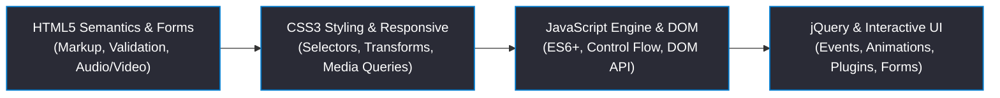

<div align="center">

# Web Programming
### Course Code: ICS 244 | ICAS, MAHE
**Modern web development foundations, HTML5 semantic elements & forms, CSS3 Flexbox & Grid responsive design, CSS3 2D/3D transforms & animations, JavaScript ES6+ engine & DOM manipulation, event handling, asynchronous JS & Fetch API, and jQuery interactive web applications.**

[](https://manipal.edu/icas.html)
[](#academic-course-information)
[](#academic-course-information)
[](https://developer.mozilla.org/)
[](https://jquery.com/)

<br/>

<table width="100%">
  <tr align="center">
    <td>
      <b>4 Modules</b><br/>
      <sub>Web Development Curriculum</sub>
    </td>
    <td>
      <b>36 Hours</b><br/>
      <sub>Course Hours</sub>
    </td>
    <td>
      <b>14 Notes & Code Files</b><br/>
      <sub>Web Modules & Apps</sub>
    </td>
    <td>
      <b>HTML5 / CSS3 / JS</b><br/>
      <sub>Full-Stack Frontend Stack</sub>
    </td>
  </tr>
</table>

</div>

---

### Academic Course Information

| Academic Attribute | Course Details & Specs |
| :--- | :--- |
| **Course Structure (L-T-P-C)** | 3-0-0-3 (3 Lecture Credits, 0 Tutorial Credits, 0 Practical Credits, 3 Total Course Credits) |
| **Contact Hours** | 36 Lecture & Live Code Execution Hours |
| **Curriculum Distribution** | 36 Hours (8h HTML5 & Semantics + 8h CSS3 Layouts + 8h JavaScript Engine + 12h jQuery & Interaction) |
| **Academic Level & Semester** | 2nd Year, Semester IV (Computer Science & Engineering) |

---

### Project Metrics

```toml
[academic.course_info]
institution       = "International Centre for Applied Sciences (ICAS)"
university        = "Manipal Academy of Higher Education (MAHE)"
course_code       = "ICS 244"
course_title      = "Web Programming"
credit_structure  = "3-0-0-3"
academic_level    = "2nd Year"
semester          = "Semester IV"

[repository.metadata]
lecture_modules      = 4
total_lecture_hours  = 36
notes_files_count    = 15
core_stack           = "HTML5 / CSS3 / JavaScript (ES6+) / jQuery 3.x / DOM API"
curriculum_status    = "100% [████████████████████████████████████████]"

[curriculum.distribution.hours]
html5_markup_semantics_forms_media   = 8
css3_selectors_transforms_responsive  = 8
javascript_syntax_control_flow_dom    = 8
jquery_dom_events_effects_plugins     = 12
```

---

### Coursework Pipeline

The curriculum maps systematically from semantic HTML5 markup and CSS3 responsive styling to dynamic JavaScript DOM manipulation and jQuery event-driven interaction:



---

### Course Modules Directory

| Chapter Unit | Covered Concepts | Key Markdown Notes & Files |
| :--- | :--- | :--- |
| **01 HTML5 & Semantics (8 Hours)** | HTML5 Herald template, Document Outline algorithm, semantic elements (`<header>`, `<nav>`, `<article>`, `<section>`, `<main>`, `<aside>`, `<footer>`, `<figure>`), W3C validation, HTML5 form attributes (`autofocus`, `placeholder`, `required`, `pattern`, `min`, `max`), new input types (`email`, `url`, `number`, `range`, `date`, `color`), `<datalist>`, `<output>`, HTML5 `<audio>` and `<video>` tags, codecs, and JS custom media controls. | • [ch01-html5-markup-structure-and-semantics.md](01-introduction-to-html5-and-semantics/ch01-html5-markup-structure-and-semantics.md)<br/>• [ch02-html5-forms-input-types-and-controls.md](01-introduction-to-html5-and-semantics/ch02-html5-forms-input-types-and-controls.md) |
| **02 CSS3 Layouts & Animations (8 Hours)** | CSS3 Attribute Selectors (`[attr^=val]`), Structural Pseudo-classes (`:nth-child()`, `:not()`), CSS Specificity Math `(a, b, c, d)`, HSL/HSLA & RGBA, `border-radius`, `box-shadow`, `text-shadow`, Linear/Radial Gradients, 2D/3D Transforms, CSS Transitions, `@keyframes` Animations, `@font-face` web fonts, Multi-column layout, Responsive `@media` queries. | • [ch03-css3-selectors-colors-borders-and-shadows.md](02-introducing-css3-layouts-and-animations/ch03-css3-selectors-colors-borders-and-shadows.md)<br/>• [ch04-css3-transforms-transitions-fonts-and-media-queries.md](02-introducing-css3-layouts-and-animations/ch04-css3-transforms-transitions-fonts-and-media-queries.md) |
| **03 JavaScript Engine & DOM (8 Hours)** | JavaScript Engine execution stack & Event Loop, Primitive vs Reference types, `var`/`let`/`const` scoping & hoisting, Type coercion (`==` vs `===`), Arrays & Object prototypes, Control flow (`if/else`, `switch`, `for`, `while`), Functions (Declarations, Expressions, Arrow functions, Closures), DOM Selection & Tree Manipulation (`getElementById`, `querySelector`, `createElement`, `appendChild`), Interactive Quiz. | • [ch05-javascript-syntax-data-types-and-variables.md](03-introduction-to-javascript/ch05-javascript-syntax-data-types-and-variables.md)<br/>• [ch06-javascript-control-flow-functions-and-objects.md](03-introduction-to-javascript/ch06-javascript-control-flow-functions-and-objects.md) |
| **04 jQuery & Interactive UI (12 Hours)** | jQuery Library architecture & `$()` wrapper, DOM Selection & Traversal (`.find()`, `.parent()`), Content manipulation (`.html()`, `.text()`, `.attr()`, `.addClass()`), Event Handling (`.on()`, `.click()`), Event Delegation, jQuery Effects & Custom Animations (`.slideToggle()`, `.fadeIn()`, `.animate()`), Accordion FAQ, Login Slider, Responsive Navigation Bar, Image Swapping, Form Validation plugins. | • [ch07-jquery-basics-selectors-and-dom-manipulation.md](04-introduction-to-jquery-and-dom-manipulation/ch07-jquery-basics-selectors-and-dom-manipulation.md)<br/>• [ch08-jquery-events-animations-effects-and-plugins.md](04-introduction-to-jquery-and-dom-manipulation/ch08-jquery-events-animations-effects-and-plugins.md) |
| **05 Solved Assessments & Exam Prep** | 100% fully solved step-by-step solutions for 1st Sessional, 2nd Sessional, 3rd Sessional exam papers, and Assignments 1, 2, and 3. | • [1st-sessional-exam-solutions.md](06-course-resources-and-assessments/1st-sessional-exam-solutions.md)<br/>• [2nd-sessional-exam-solutions.md](06-course-resources-and-assessments/2nd-sessional-exam-solutions.md)<br/>• [3rd-sessional-exam-solutions.md](06-course-resources-and-assessments/3rd-sessional-exam-solutions.md)<br/>• [assignment-01-solutions.md](06-course-resources-and-assessments/assignment-01-solutions.md)<br/>• [assignment-02-solutions.md](06-course-resources-and-assessments/assignment-02-solutions.md)<br/>• [assignment-03-solutions.md](06-course-resources-and-assessments/assignment-03-solutions.md) |

---

### Text / Reference Books

1. **Alexis Goldstein, Louis Lazaris, Estelle Weyl**, *HTML5 and CSS3 for The Real World*, 2nd Edition, SitePoint, 2015.
2. **David Sawyer McFarland**, *JavaScript and jQuery: The Missing Manual*, 3rd Edition, O'Reilly Media, 2014.
3. **Matthew MacDonald**, *HTML5: The Missing Manual*, 2nd Edition, O'Reilly Media, 2013.
4. **Jon Duckett, Gilles Ruppert, Jack Moore**, *JavaScript and JQuery: Interactive Front-End Web Development*, John Wiley & Sons, 2014.
5. **Ed Tittel, Chris Minnick**, *Beginning HTML5 & CSS3 for Dummies*, A Wiley Brand, 2013.

---

### Technical Guide

<details>
<summary><b>W3C HTML5 Validation & Local Web Server Execution</b></summary>

```bash
# Local Static Web Server Execution using Python
python3 -m http.server 8000

# Open Local Browser to View App
# Navigate to: http://localhost:8000

# W3C Markup Validation Command-Line (vnu)
vnu --html index.html
```

</details>
